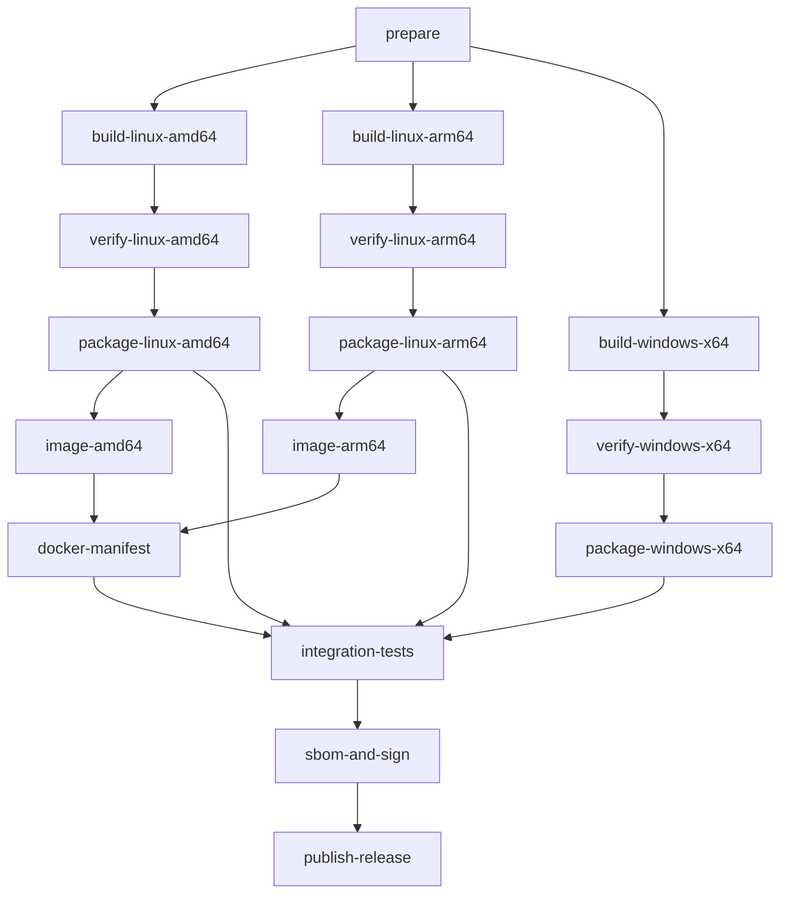

# GitHub Actions 构建与打包详细设计

## 1. 文档信息

| 项目 | 内容 |
|---|---|
| 状态 | 详细设计讨论稿 |
| 日期 | 2026-08-17 |
| 关联方案 | [禅道 FrankenPHP 集成环境技术方案](./frankenphp-integration-technical-plan.md) |
| CI 平台 | GitHub Actions |
| Runner 范围 | GitHub-hosted Runner |
| 目标平台 | Windows x86_64、Linux amd64、Linux arm64、Docker amd64/arm64 |
| Runtime Host | [自研 Caddy + FrankenPHP Library Host](./runtime-host-library-design.md) |

## 2. 设计目标

本设计用于指导后续实现一套基于 GitHub-hosted Runner 的自动构建、测试、打包和发布流水线。

流水线需要实现：

1. 使用统一的版本清单锁定 PHP、FrankenPHP、ionCube、MySQL 和构建工具。
2. 在目标架构的原生 Runner 上编译 CGO、PHP Embed SAPI 和自研 `zentao-runtime` Host。
3. 构建 Linux amd64、Linux arm64 和 Windows x86_64 Runtime。
4. 从 Runtime 组装 Windows/Linux Runtime 包和 Full + MySQL 包。
5. 从 Linux Runtime 构建 Docker amd64/arm64 镜像并合并多架构 manifest。
6. 对开源版、企业版、旗舰版和 IPD 版执行分层测试。
7. 生成 SHA256、组件清单、SBOM、构建证明和签名。
8. PR 构建与正式发布严格隔离，避免不可信代码接触签名凭据和付费版制品。

## 3. 非目标

首期不处理以下事项：

- 不在一台 Linux Runner 上交叉编译 Windows PHP/Runtime Host。
- 不从源码编译 MySQL。
- 不使用 FrankenPHP worker mode。
- 不把 MySQL 放入 FrankenPHP Docker 镜像。
- 不在 PR workflow 中执行正式发布、代码签名或付费版制品下载。
- 不在本设计阶段创建 `.github/workflows` 或构建脚本。

## 4. 核心设计原则

### 4.1 原生构建，不做强行跨平台 CGO

自研 Runtime Host 同时链接 Caddy、FrankenPHP 和 PHP Embed SAPI，并使用 CGO。Windows Runtime 依赖 MSVC ABI、`php8ts.dll`、`php8embed.lib` 和 Windows PHP 扩展。因此采用统一编排、目标平台原生构建：

| Target | GitHub Runner | 构建方式 |
|---|---|---|
| Linux amd64 | `ubuntu-24.04` | 原生编译 PHP 与 Go Runtime Host |
| Linux arm64 | `ubuntu-24.04-arm` | 原生编译 PHP 与 Go Runtime Host |
| Windows x86_64 | `windows-2025` | Clang + PHP VS17 TS + Go Runtime Host |
| Docker amd64 | `ubuntu-24.04` | 使用 Linux amd64 Runtime 构建镜像 |
| Docker arm64 | `ubuntu-24.04-arm` | 使用 Linux arm64 Runtime 构建镜像 |

Runner 标签在实现前需要用目标仓库验证。若组织当前不能使用 `ubuntu-24.04-arm`，可以临时使用 Buildx + QEMU 生成开发镜像，但正式发布仍需要真实 arm64 Runner 完成 Runtime 和集成测试。

### 4.2 一次编译，多种组装

每个平台的 PHP 和 `zentao-runtime` Host 只编译一次，输出标准 Runtime staging artifact。Runtime 包、Full 包和 Docker 镜像都消费该 artifact，避免同一版本在不同交付物中重复编译并产生差异。

### 4.3 版本不可漂移

workflow 不接受 `latest` 作为组件版本。所有远程制品必须同时固定 URL、版本和 SHA256。

### 4.4 构建与发布分离

构建 Job 只生成未签名候选制品。签名、构建证明和 Release 发布由受保护的发布 Job 完成。

## 5. 推荐仓库布局

后续实现阶段建议采用以下目录。本文档不会创建这些文件：

```text
.github/
  workflows/
    runtime-ci.yml
    runtime-release.yml
    runtime-scheduled.yml

runtime/
  docs/
  host/
    go.mod
    go.sum
    cmd/zentao-runtime/
    internal/
  versions.lock.yml
  patches/
    php-8.4/
      0001-ioncube-zend-signal-abi-shim.patch
  scripts/
    common/
      download.sh
      verify-checksum.sh
      generate-manifest.sh
    linux/
      install-dependencies.sh
      build-php.sh
      build-host.sh
      assemble-runtime.sh
      verify-runtime.sh
      package.sh
    windows/
      Install-Dependencies.ps1
      Build-Host.ps1
      Assemble-Runtime.ps1
      Verify-Runtime.ps1
      Package.ps1
    docker/
      prepare-context.sh
      verify-image.sh
  config/
    common/
      runtime.yml
      caddy-base.json
      php.ini
    linux/
    windows/
    mysql/
  packaging/
    linux/
    windows/
    docker/
  tests/
    smoke/
    ioncube/
    install/
    upgrade/
```

## 6. 版本锁定设计

### 6.1 版本清单

建议使用 `runtime/versions.lock.yml` 作为唯一版本来源：

```yaml
schema: 1

php:
  version: 8.4.24
  source:
    url: https://www.php.net/distributions/php-8.4.24.tar.xz
    sha256: e127be09a8506f4327c5cfa78a614b00d210714484ec215ce0011b4a03c00731
  windows:
    runtime:
      url: https://downloads.php.net/~windows/releases/archives/php-8.4.24-Win32-vs17-x64.zip
      sha256: 7b57fc9840273ab153834d0e2bd06e0bcf4fead36e381182b4b8fe9cedff3174
    development:
      url: https://downloads.php.net/~windows/releases/archives/php-devel-pack-8.4.24-Win32-vs17-x64.zip
      sha256: 893f5b8ffe515eb07c080e1bdba8cbb0ddf935c76fc1088ddbe46d46f528236c

frankenphp:
  version: 1.12.7
  repository: https://github.com/php/frankenphp.git
  commit: <verified-commit-sha>

caddy:
  version: <exact-go-module-version>
  module_sum: <required-go-sum-entry>

runtime_host:
  module: <company-module-path>
  revision: 1

ioncube:
  php: "8.4"
  linux_amd64:
    url: <fixed-or-controlled-url>
    sha256: <required>
  linux_arm64:
    url: <fixed-or-controlled-url>
    sha256: <required>
  windows_x64:
    url: <fixed-or-controlled-url>
    sha256: <required>

mysql:
  version: 8.4.x
  linux_amd64:
    url: <official-archive-url>
    sha256: <required>
  linux_arm64:
    url: <official-archive-url>
    sha256: <required>
  windows_x64:
    url: <official-archive-url>
    sha256: <required>
```

示例中的 PHP SHA256 已按当前公开制品核对。FrankenPHP commit、ionCube 和 MySQL 信息必须在实现时补齐，缺失时 workflow 应在 `prepare` Job 直接失败。

### 6.2 ionCube 下载稳定性

ionCube 公共下载 URL 可能在相同路径下更新内容，不能只锁 URL。推荐顺序：

1. 在获得再分发授权后，将确定版本存入公司制品仓库并锁定不可变 URL。
2. 或使用厂商 URL，但每次下载强制校验已评审的 SHA256。
3. SHA256 不匹配时停止构建，不允许自动接受新文件。

### 6.3 清单输出

每个 Runtime artifact 需要携带 `manifest.json`，记录：

```text
target OS/architecture
Git commit and Git ref
GitHub run ID/attempt
Runner image and image version
PHP version/API/configure flags
PHP patch SHA256
FrankenPHP version/commit
Caddy module version
Runtime Host version/commit
ionCube archive and Loader SHA256
PHP extensions and versions
compiler/linker/Go versions
build timestamp in UTC
```

## 7. Workflow 拆分

建议拆分为三个 workflow。

### 7.1 `runtime-ci.yml`

触发条件：

- 修改 `runtime/**` 的 Pull Request。
- 修改 `runtime/**` 的非发布分支 push。
- 手工 `workflow_dispatch`。

职责：

- 校验版本清单、补丁和脚本。
- 编译 Runtime。
- 执行公开测试和开源版冒烟测试。
- 上传短期保留的候选 artifacts。
- 不访问发布、签名和付费版 secrets。

### 7.2 `runtime-release.yml`

触发条件：

- 符合命名规范的 Git tag。
- 受保护环境中的手工触发。

职责：

- 重建或下载同一 commit 的已验证 Runtime。
- 执行付费版和升级测试。
- 组装 Runtime/Full 包和 Docker 镜像。
- 生成 SBOM、签名和构建证明。
- 发布 GitHub Release 和容器镜像。

### 7.3 `runtime-scheduled.yml`

触发条件：

- 每周或每月定时执行。

职责：

- 检查 Runner 镜像变化造成的构建回归。
- 检查上游版本，但不自动修改版本锁。
- 重新执行长时间稳定性和依赖漏洞扫描。

## 8. Job 拓扑



PR workflow 可以在 `verify-*` 后结束。Full 包、Docker push、付费版测试、签名和发布只在可信 release workflow 中执行。

## 9. `prepare` Job 设计

### 9.1 Runner

```yaml
runs-on: ubuntu-24.04
```

### 9.2 职责

1. Checkout 当前 commit，禁止持久化 Git 凭据。
2. 解析并校验 `versions.lock.yml` schema。
3. 确保所有 URL 使用 HTTPS。
4. 确保所有远程制品具有非空 SHA256。
5. 校验 PHP patch 能应用到锁定的 PHP 源码。
6. 计算补丁、配置模板和构建脚本的组合哈希。
7. 生成各平台 matrix JSON。
8. 将版本和组合哈希作为 Job outputs。

### 9.3 Matrix 输出示例

```json
{
  "include": [
    {
      "target": "linux-amd64",
      "runner": "ubuntu-24.04",
      "goarch": "amd64"
    },
    {
      "target": "linux-arm64",
      "runner": "ubuntu-24.04-arm",
      "goarch": "arm64"
    }
  ]
}
```

版本值必须来自受信任的仓库文件，不能在 shell 中直接拼接来自 PR 标题、分支名或未经校验的 workflow input。

## 10. Linux Runtime 构建设计

### 10.1 Runner Matrix

```yaml
strategy:
  fail-fast: false
  matrix: ${{ fromJSON(needs.prepare.outputs.linux_matrix) }}

runs-on: ${{ matrix.runner }}
```

amd64 和 arm64 执行相同脚本，只通过架构、Runner 和版本清单区分。

### 10.2 依赖安装

构建 Job 通过 apt 安装固定的依赖集合，至少包括：

```text
autoconf
bison
build-essential
curl
git
libargon2-dev
libcurl4-openssl-dev
libfreetype6-dev
libicu-dev
libjpeg-dev
libldap2-dev
libonig-dev
libpng-dev
libpq-dev
libreadline-dev
libsodium-dev
libsqlite3-dev
libssl-dev
libxml2-dev
libxslt1-dev
libzip-dev
pkg-config
re2c
unzip
xz-utils
```

实际列表以 PHP configure 检查结果为准。Runner apt 仓库版本会变化，因此 manifest 必须记录安装后的 package version；发布前需要保留构建日志。

### 10.3 PHP 源码准备

```text
下载 PHP 源码
  -> sha256sum --check
  -> 解压到工作目录
  -> patch --dry-run
  -> 应用 ionCube ABI patch
  -> 记录 patched source hash
```

补丁失败应被视为 PHP 源码发生不兼容变化，禁止使用模糊匹配继续构建。

### 10.4 PHP configure 基线

设计基线如下，最终参数由 PoC 确认：

```bash
./configure \
  --prefix="$PHP_PREFIX" \
  --with-config-file-path="$RUNTIME_ROOT/config" \
  --with-config-file-scan-dir="$RUNTIME_ROOT/config/conf.d" \
  --enable-embed=shared \
  --enable-zts \
  --disable-zend-signals \
  --enable-zend-max-execution-timers \
  --enable-opcache \
  --enable-mbstring \
  --enable-intl \
  --enable-bcmath \
  --enable-sockets \
  --enable-gd \
  --with-jpeg \
  --with-freetype \
  --with-curl \
  --with-openssl \
  --with-zlib \
  --with-zip \
  --with-pdo-mysql=mysqlnd \
  --with-mysqli=mysqlnd \
  --with-pdo-pgsql \
  --with-pgsql \
  --with-ldap
```

PHP 构建必须生成 CLI、`php-config`、共享 `libphp.so` 和所需扩展。Web 与 Scheduler 必须使用同一 Runtime。

### 10.5 Runtime Host 构建

Runtime Host 的 `go.mod` 固定 Caddy 和 FrankenPHP module 版本，并由 `go.sum` 校验 module 内容。构建目标是 `./cmd/zentao-runtime`，不是上游 `frankenphp` CLI。

核心环境：

```text
CGO_ENABLED=1
CGO_CFLAGS=<php-config --includes>
CGO_LDFLAGS=<php-config --ldflags and --libs>
```

Host main package 显式 blank import Caddy standard modules 和 FrankenPHP Caddy module。建议首期关闭禅道不需要的可选模块以减少动态依赖和攻击面，但 build tags 必须先用锁定的 FrankenPHP 版本验证：

```text
nobadger
nomysql
nopgx
nowatcher
nobrotli
nomercure
```

其中 `nomysql` 和 `nopgx` 只关闭 Caddy 内部存储模块，不影响 PHP 的 `pdo_mysql` 和 `pdo_pgsql`。

如果这些 tags 与目标 FrankenPHP 版本不兼容，优先跟随上游官方构建约束，不允许静默忽略未知 tag。Host 直接执行 `go build ./cmd/zentao-runtime`，不使用 xcaddy 生成或替换自研 main package。

### 10.6 动态库收集

Runtime 需要包含：

- `zentao-runtime`。
- PHP CLI。
- `libphp.so`。
- PHP 动态扩展。
- ionCube TS Loader。
- 非基础系统提供且允许再分发的共享库。

使用 `readelf`、`ldd` 或 `lddtree` 枚举依赖，建立明确的允许列表。不能简单复制 Runner 上发现的全部 `.so`。

需要在 PoC 中确定以下发布策略之一：

1. 在包中携带允许再分发的共享库，并设置相对 RPATH。
2. 明确支持的 Linux 发行版和系统依赖，由安装器检查并安装。
3. 同时提供通用 tar 包和发行版专用 deb/rpm。

推荐首版采用第 2、3 项组合，Docker 作为依赖最稳定的交付方式。

### 10.7 Linux staging 契约

```text
stage/
  runtime/
    bin/zentao-runtime
    bin/php
    lib/libphp.so
    lib/php/extensions/
  config/
    runtime.yml
    caddy-base.json
    php.ini
    conf.d/00-ioncube.ini
    conf.d/10-opcache.ini
  app/
  licenses/
  manifest.json
```

staging artifact 内不包含数据库数据、日志、运行时生成的密钥和用户配置。

## 11. Windows Runtime 构建设计

### 11.1 Runner

```yaml
runs-on: windows-2025
```

如果 `windows-2025` 在目标仓库暂不可用，则临时使用 `windows-2022`。不建议长期使用漂移的 `windows-latest`，但 manifest 仍必须记录实际 Runner image version。

### 11.2 PHP Runtime

Windows 不需要 Linux ionCube signal ABI patch。直接下载锁定版本的：

- PHP 8.4 VS17 x64 Thread Safe Runtime ZIP。
- PHP 8.4 VS17 x64 Development Package。
- ionCube Windows VC17 x86-64 Loader。

所有 ZIP 在解压前校验 SHA256。

### 11.3 工具链

工具链跟随 FrankenPHP 官方 Windows workflow 的已验证组合，但最终 `go build` 目标改为自研 Runtime Host：

```text
Visual Studio 2022 LLVM/Clang
Go locked by FrankenPHP go.mod/toolchain
PHP VS17 TS Runtime
PHP VS17 Development Package
vcpkg dependencies
Watcher dependency when enabled
```

核心环境变量：

```powershell
$env:CC = "clang"
$env:CXX = "clang++"
$env:CGO_ENABLED = "1"
$env:CGO_CFLAGS = "-I<php-devel includes> ..."
$env:CGO_LDFLAGS = "-L<php-runtime> -L<php-devel-lib> -lphp8ts -lphp8embed"
```

FrankenPHP 官方 Windows 构建会链接 `php8ts` 和 `php8embed`，并使用 Clang/LLD 与 MSVC 构建的 PHP ABI 协作。Runtime Host 复用这些 CGO 参数，同时链接 Caddy 和 FrankenPHP Go modules；后续实现应基于锁定版本的上游 workflow，而不是重新推导一套未验证命令。

### 11.4 Windows staging 契约

```text
stage/
  runtime/
    zentao-runtime.exe
    php.exe
    php8ts.dll
    php8embed.lib or required runtime files
    ext/*.dll
    dependent runtime DLLs
  config/
    runtime.yml
    caddy-base.json
    php.ini
    conf.d/00-ioncube.ini
    conf.d/10-opcache.ini
  app/
  service/
    zentao-runtime-service.xml
  licenses/
  manifest.json
```

Windows 路径测试必须包含：

- 带空格的路径。
- 非 ASCII 字符路径。
- 非管理员前台运行。
- 管理员安装 Windows Service。

### 11.5 Windows 签名

PR 和普通 push 不执行签名。Release Job 通过受保护 GitHub Environment 获取签名能力。

优先方案是 GitHub OIDC 连接 Azure Key Vault、可信签名服务或企业 HSM，避免把长期 PFX 和密码直接保存为 GitHub Secrets。签名顺序：

1. 签名 `zentao-runtime.exe` 和需要分发的服务组件。
2. 签名最终安装器。
3. 验证 Authenticode chain 和时间戳。
4. 生成签名结果摘要。

## 12. ionCube ABI 验证设计

### 12.1 Linux 静态验证

```bash
nm -D "$LIBPHP" | grep zend_signal
nm -D --undefined-only "$IONCUBE_LOADER"
readelf -Ws "$LIBPHP" | grep zend_signal
```

必须满足：

- `libphp.so` 导出 `zend_signal_globals_id`。
- `libphp.so` 导出 `zend_signal_globals_offset`。
- `libphp.so` 导出 `zend_signal_handler_unblock`。
- ionCube 不再存在未解析的 `zend_signal_*` 符号。
- 没有出现未评审的新 `zend_signal_*` 依赖。

### 12.2 运行验证

```text
zentao-runtime php-cli -- --ri "ionCube Loader"
zentao-runtime php-cli -- -r "exit(extension_loaded('ionCube Loader') ? 0 : 1);"
启动 Runtime Host、Caddy 和 Classic mode PHP
请求公开 PHP 冒烟入口
请求 ionCube 加密冒烟入口
停止服务并检查退出状态
```

必须验证 PHP 仍报告 Zend Signal Handling 为 disabled，并验证进程可以响应 `SIGTERM`。

### 12.3 Loader 升级防线

每次 ionCube SHA256 变化时：

1. 阻止 Dependabot 或自动任务直接合并。
2. 输出新旧未定义符号 diff。
3. 由 Runtime 维护者评审。
4. 执行并发和长时间测试。
5. 重新批准版本锁修改。

## 13. 应用制品设计

### 13.1 平台无关应用包

禅道 PHP、前端静态资源和版本信息先生成平台无关应用 artifact：

```text
zentao-app-<edition>-<version>.tar.zst
```

该 artifact 不包含 PHP Runtime、数据库和平台脚本。

### 13.2 版本矩阵

```text
opensource
biz
max
ipd
```

不同版本存在包含关系，应用合并过程应在独立可信 Job 中完成，并记录参与合并的各代码仓库 commit。

### 13.3 付费版保护

付费版应用 artifact 不应上传到公开 PR run，也不应设置过长的 artifact retention。

建议：

- 只在受保护 release workflow 下载或生成。
- 使用受保护 Environment 和最小权限凭据。
- 测试结束后依赖 GitHub artifact retention 自动清理。
- 日志不得打印下载 URL、授权信息或文件内容。

## 14. Runtime 包与 Full 包组装

### 14.1 Runtime 包

命名建议：

```text
zentao-runtime-<zentao-version>-windows-x86_64.zip
zentao-runtime-<zentao-version>-linux-amd64.tar.zst
zentao-runtime-<zentao-version>-linux-arm64.tar.zst
```

### 14.2 Full 包

Full 包在已验证 Runtime staging 上增加对应平台的 MySQL 官方二进制包：

```text
zentao-full-<zentao-version>-mysql-<mysql-version>-windows-x86_64.zip
zentao-full-<zentao-version>-mysql-<mysql-version>-linux-amd64.tar.zst
zentao-full-<zentao-version>-mysql-<mysql-version>-linux-arm64.tar.zst
```

MySQL 只组装，不在 CI 中初始化正式数据目录。首次安装时由管理工具完成：

- 创建数据目录。
- 生成随机凭据。
- 初始化系统表。
- 创建禅道数据库和最小权限账号。
- 写入受限权限的本地配置。

### 14.3 包内禁止内容

- 固定数据库密码。
- CI 临时文件。
- GitHub Token 或云凭据。
- 测试数据库。
- Runner 绝对路径。
- 未清理的调试符号，除非作为独立 debug artifact 发布。

### 14.4 安装器策略

首版建议先发布可解压 Runtime/Full 包和服务管理脚本。待目录、升级和卸载行为稳定后，再增加：

- Windows Inno Setup/WiX 安装器。
- Linux deb/rpm 包。

安装器必须消费相同 staging artifact，不得重新编译 Runtime。

## 15. Docker 多架构设计

### 15.1 不使用 QEMU 编译正式 Runtime

Linux Runtime 已分别由 amd64/arm64 原生 Runner 构建。Docker Job 只把对应架构 Runtime 放入镜像，不重复编译 PHP、Caddy、FrankenPHP 和 Runtime Host。

### 15.2 分架构构建

```text
image-amd64:
  runner: ubuntu-24.04
  input: zentao-runtime-linux-amd64
  output: registry/repository@sha256:<amd64-digest>

image-arm64:
  runner: ubuntu-24.04-arm
  input: zentao-runtime-linux-arm64
  output: registry/repository@sha256:<arm64-digest>
```

每个 Job 在本架构原生启动容器并运行冒烟测试后才 push by digest。

### 15.3 合并 manifest

`docker-manifest` Job 下载两个 digest artifact，通过 Buildx imagetools 创建：

```text
ghcr.io/<org>/zentao:<zentao-version>
ghcr.io/<org>/zentao:<zentao-version>-php8.4
ghcr.io/<org>/zentao:latest             # 仅稳定正式版更新
```

不得通过 tag 读取刚推送的架构镜像再合并，必须使用不可变 digest，防止竞态覆盖。

### 15.4 Docker Compose

Compose 包含：

```text
web        zentao-runtime，内含 Caddy + FrankenPHP Classic mode
scheduler  相同镜像，不同启动命令
mysql      固定 MySQL 镜像，可选 profile
```

外部 PostgreSQL 模式不启动 `mysql` service，通过环境变量配置数据库连接。

## 16. Artifact 数据流

### 16.1 Artifact 契约

| Artifact | 生产 Job | 消费 Job |
|---|---|---|
| `source-metadata` | prepare | 全部构建 Job |
| `app-<edition>` | app-build | package、integration-tests |
| `runtime-linux-amd64` | build-linux | package、image-amd64 |
| `runtime-linux-arm64` | build-linux | package、image-arm64 |
| `runtime-windows-x64` | build-windows | package-windows |
| `package-*` | package jobs | integration-tests、release |
| `image-digest-*` | image jobs | docker-manifest |
| `test-results-*` | verify/integration | release gate |
| `sbom-*` | sbom | release |

### 16.2 Artifact 安全

- 上传和下载 actions 固定到完整 commit SHA。
- 下载时校验 artifact 内的 manifest 和 SHA256。
- 不通过 artifact 名称携带未过滤的分支名。
- PR artifacts 设置较短 retention。
- Release candidate artifacts 设置满足审批周期的 retention。
- 付费版 artifacts 只存在于可信 workflow。

## 17. 缓存设计

### 17.1 可缓存内容

- Go module cache。
- Go build cache。
- 下载后已校验的 PHP 源码归档。
- vcpkg binary cache。
- Composer 或前端依赖缓存，若应用构建需要。

### 17.2 不缓存内容

- 最终 Runtime 二进制。
- ionCube 或 MySQL 制品，除非许可证允许且缓存严格受控。
- 付费版应用包。
- 签名后制品。
- 数据库数据目录。

### 17.3 Cache Key

```text
runtime-<target>-<php-version>-<frankenphp-commit>-<patch-hash>-<script-hash>
```

PR workflow 只能读取主分支产生的安全依赖缓存，不应让不可信 PR 覆盖发布使用的缓存。

## 18. 测试分层

### 18.1 L0：设计与静态校验

- YAML/schema 校验。
- ShellCheck。
- PSScriptAnalyzer。
- actionlint。
- patch dry-run。
- URL 和 SHA256 完整性检查。

### 18.2 L1：Runtime 单元验证

- `zentao-runtime version`。
- `zentao-runtime php-cli -- -v`。
- PHP API、ZTS 和扩展列表。
- ionCube Loader 加载。
- `libphp` 动态依赖检查。
- 配置文件路径和扫描目录检查。

### 18.3 L2：Classic mode 冒烟测试

- 启动 `zentao-runtime`，并确认 Caddy 和 FrankenPHP ready。
- 首页静态文件。
- PHP 普通脚本。
- PATH_INFO。
- 上传和下载。
- Session 跨请求持久化。
- 连续请求不复用请求级全局状态。
- 优雅停止。

### 18.4 L3：禅道安装测试

分别连接：

- MySQL。
- PostgreSQL。

验证安装向导、数据库建表、管理员登录和核心页面。

### 18.5 L4：付费版测试

在可信 release workflow 中执行：

- 企业版 ionCube 解密。
- 旗舰版 ionCube 解密。
- IPD 版 ionCube 解密。
- Web 与 Scheduler CLI 同时验证。
- OPcache 开启验证。

### 18.6 L5：升级测试

- 现有 Windows 一键包升级。
- 现有 Linux 一键包升级。
- 现有 Docker 数据卷升级。
- MySQL 和 PostgreSQL 分别验证。

### 18.7 L6：稳定性测试

- Classic mode 并发压测。
- 24 小时稳定性测试。
- 大附件上传下载。
- Scheduler 长时间运行。
- `SIGTERM`、异常退出和自动重启。

L5、L6 可以放在 scheduled workflow 或 release candidate 环境，不应阻塞每个普通 PR。

## 19. GitHub Actions 安全设计

### 19.1 权限

默认 workflow：

```yaml
permissions:
  contents: read
```

仅特定 Job 增加：

```text
packages: write        Docker push
contents: write        GitHub Release
id-token: write        OIDC、keyless signing、attestation
attestations: write    GitHub artifact attestation
```

### 19.2 Actions 固定版本

所有第三方 action 必须固定完整 commit SHA，并由 Dependabot 提交升级 PR。禁止只写 `@main`、`@master` 或浮动 major tag。

### 19.3 Fork PR

Fork PR：

- 不注入 secrets。
- 不下载付费版制品。
- 不执行签名和 push。
- 不使用 `pull_request_target` 执行 PR 中的脚本。

### 19.4 Release Environment

建立受保护的 `runtime-release` Environment：

- 要求指定人员审批。
- 仅允许 tag 或受保护分支。
- OIDC subject 限制到指定 repository、workflow 和 environment。
- 发布 Job 不能 checkout 未审查的外部 ref。

### 19.5 构建证明

正式产物建议同时生成：

- GitHub artifact attestation。
- SPDX 或 CycloneDX SBOM。
- SHA256SUMS。
- Cosign keyless signature，适用于 OCI 镜像和可签名 blob。
- Windows Authenticode signature。

## 20. 发布设计

### 20.1 Tag 规范

建议 Runtime 构建与禅道版本关联：

```text
runtime/v<zentao-version>-r<runtime-revision>
```

示例：

```text
runtime/v22.0-r1
```

Runtime revision 用于 PHP、FrankenPHP、ionCube 或打包脚本升级，但禅道业务版本不变的情况。

### 20.2 发布前门槛

必须全部满足：

- 三个平台 Runtime 构建成功。
- ionCube 静态和运行验证成功。
- 开源版 MySQL/PostgreSQL 安装测试成功。
- 付费版解密测试成功。
- Runtime/Full 包安装测试成功。
- Docker 两个架构原生启动成功。
- SBOM、SHA256 和签名生成成功。
- 法务允许再分发 ionCube、MySQL 和其他共享库。

### 20.3 发布顺序

```text
上传 immutable artifacts
  -> push OCI images by digest
  -> merge Docker manifest
  -> 生成并验证签名
  -> 创建 GitHub Release draft
  -> 人工审批
  -> 发布 Release
  -> 更新稳定 Docker tag
```

先创建不可变内容，最后更新可变稳定 tag，避免部分失败导致用户拿到不完整版本。

## 21. Workflow 设计级伪代码

以下仅表达 Job 关系，不是可直接运行的实现：

```yaml
name: Runtime release

on:
  workflow_dispatch:
  push:
    tags:
      - runtime/v*

permissions:
  contents: read

concurrency:
  group: runtime-release-${{ github.ref }}
  cancel-in-progress: false

jobs:
  prepare:
    runs-on: ubuntu-24.04
    outputs:
      linux_matrix: ${{ steps.matrix.outputs.linux }}
    steps:
      - uses: actions/checkout@<full-commit-sha>
      - run: runtime/scripts/validate-design-inputs.sh

  build-linux:
    needs: prepare
    strategy:
      fail-fast: false
      matrix: ${{ fromJSON(needs.prepare.outputs.linux_matrix) }}
    runs-on: ${{ matrix.runner }}
    steps:
      - uses: actions/checkout@<full-commit-sha>
      - run: runtime/scripts/linux/build.sh "${{ matrix.target }}"
      - uses: actions/upload-artifact@<full-commit-sha>

  build-windows:
    needs: prepare
    runs-on: windows-2025
    steps:
      - uses: actions/checkout@<full-commit-sha>
      - shell: pwsh
        run: ./runtime/scripts/windows/Build.ps1
      - uses: actions/upload-artifact@<full-commit-sha>

  package:
    needs: [build-linux, build-windows]
    # Download verified Runtime artifacts and assemble Runtime/Full packages.

  docker:
    needs: build-linux
    # Build and test one image per native architecture, then merge by digest.

  integration:
    needs: [package, docker]
    # Run trusted edition, database, install and upgrade tests.

  release:
    needs: integration
    environment: runtime-release
    permissions:
      contents: write
      packages: write
      id-token: write
      attestations: write
    # Sign, attest and publish immutable artifacts.
```

实现时应避免将完整构建逻辑写进 YAML。YAML 只负责权限、Runner、Job 关系和 artifact 流转；可本地运行的脚本负责实际构建与校验。

## 22. 可观测性与故障诊断

每个 Job 应写入 GitHub Step Summary：

```text
target
component versions
cache hit/miss
build duration
artifact size and SHA256
test summary
warnings
links to test reports and SBOM
```

失败时上传以下诊断内容，但不得包含 secrets：

- PHP configure log。
- 编译器错误日志。
- `ldd`/`readelf`/PE dependency 输出。
- Runtime Host、Caddy、FrankenPHP 和 PHP 启动日志。
- 测试报告。
- 安装器日志。

大日志先压缩为 artifact，Step Summary 只保留高信号摘要。

## 23. 重试与恢复

### 23.1 可重试操作

- 公共依赖下载可以有限重试，并在重试后继续执行 SHA256 校验。
- GitHub artifact 上传可以按 action 自身策略重试。
- 容器 push 使用 digest 验证结果。

### 23.2 不应自动重试的操作

- SHA256 不匹配。
- PHP patch 失败。
- ionCube 新增未知符号。
- 签名验证失败。
- 安装或升级测试失败。

### 23.3 Release 恢复

每个发布 Job 应具有幂等性：

- 相同内容产生相同命名和摘要。
- 已存在且摘要一致的不可变制品可以复用。
- 已存在但摘要不同的制品视为冲突并停止。
- 稳定 tag 只在全部步骤成功后更新。

## 24. 成本与时长控制

建议控制策略：

- PR 默认只构建 Linux amd64 和执行 L0-L2。
- 标记为 Runtime 相关的 PR 再展开 Linux arm64 和 Windows。
- 合并到受保护分支后执行三平台完整 Runtime 构建。
- Full 包、Docker push、付费版和升级测试只在 release candidate 执行。
- 24 小时稳定性测试放在 scheduled workflow。

不能为了减少耗时而跳过正式版本的原生 arm64 验证、ionCube 检查或安装测试。

## 25. 实施阶段

### 阶段一：CI 骨架

- 建立版本锁 schema。
- 建立 `prepare` 和静态检查。
- 建立 artifact 命名与 manifest 格式。
- 验证 GitHub-hosted ARM64 Runner 可用性。

### 阶段二：Linux Runtime

- 实现 PHP patch 和构建。
- 实现 Caddy + FrankenPHP Library Runtime Host 构建。
- 实现 amd64/arm64 Runtime staging。
- 完成 ionCube 和 Classic mode L1-L2 测试。

### 阶段三：Windows Runtime

- 跟随上游 Windows CGO workflow 构建自研 Runtime Host。
- 完成 ionCube、路径和服务测试。
- 完成 Windows Runtime staging。

### 阶段四：打包和 Docker

- 实现 Runtime/Full 包。
- 实现原生架构 Docker image Job。
- 实现多架构 manifest 和 Compose。

### 阶段五：发布安全

- 接入 SBOM、attestation 和签名。
- 建立受保护 release Environment。
- 完成付费版、升级和稳定性测试。

## 26. 验收标准

设计落地后，需要满足：

1. GitHub-hosted Runner 可以重复生成三平台 `zentao-runtime` Host 和 Runtime 包。
2. 相同 commit 和版本锁产生的 manifest 组件版本一致。
3. Linux amd64/arm64 均能加载 ionCube 和运行付费版。
4. Windows 能使用官方 ionCube Loader 运行付费版。
5. Classic mode 不复用请求状态，Web 与 Scheduler 均正常。
6. Runtime 和 Full 包可以在全新环境安装、启动、停止、升级和卸载。
7. Docker manifest 同时包含 amd64 和 arm64，两个架构均原生测试。
8. MySQL 和 PostgreSQL 安装测试通过。
9. PR 无法访问发布 secrets 和付费版 artifacts。
10. Release 产物具有 SHA256、SBOM、签名和构建证明。

## 27. 实施前待确认事项

1. 目标 GitHub 仓库是否能使用 `ubuntu-24.04-arm` 和 `windows-2025`。
2. GitHub 仓库是公开还是私有，以及 Actions 分钟数和 artifact 配额。
3. ionCube、MySQL 和依赖共享库的再分发范围。
4. 付费版应用 artifact 的来源和保留策略。
5. Windows 代码签名服务和证书托管方式。
6. 容器镜像发布到 GHCR 还是现有企业 Registry。
7. 首期支持的 Linux 发行版和最低 glibc 版本。
8. 首期交付是否包含 Windows 安装器、deb 和 rpm，还是先发布压缩包。
9. Full 包采用的 MySQL 8.4 具体 patch 版本。
10. 正式发布需要支持的禅道历史升级起点。
