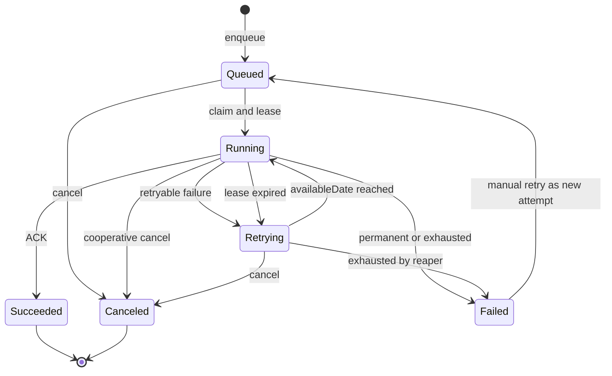

# 禅道 Runtime 消息队列详细设计

## 1. 文档信息

| 项目 | 内容 |
|---|---|
| 状态 | Runtime 侧已实施；PHP Queue Service 待禅道适配 |
| 日期 | 2026-08-17 |
| Runtime Host | 自研 Go 程序 `zentao-runtime` |
| Go 编排 | 标准 Go Worker Pool；Watermill Core 作为 POC 对照项 |
| 数据库访问 | PHP Queue Service + 禅道 DAO |
| 数据库范围 | 禅道已支持的 MySQL、PostgreSQL 及信创数据库 |
| 消费语义 | At-least-once |
| 部署模式 | 单机、多节点 |
| 关联设计 | [Caddy + FrankenPHP Library Runtime Host 详细设计](./runtime-host-library-design.md) |
| 集成方案 | [禅道 FrankenPHP 集成环境技术方案](./frankenphp-integration-technical-plan.md) |

## 2. 核心结论

新的消息队列继续使用禅道业务数据库作为持久化存储，但不再复用当前
`zt_queue` 的消费协议（表结构将原地改造为新任务 Schema），也不从零实现
完整的消息处理框架。

正式方案如下：

1. Go Runtime 不直接连接禅道数据库，不打包数据库驱动，也不持有数据库凭据。
2. 入队、领取、心跳、完成、重试和回收全部由 PHP Queue Service 通过现有 DAO 执行。
3. Go Runtime 通过只在本机可访问的 PHP Queue Bridge 管理 Worker、并发、超时和生命周期。
4. PHP 生产者优先在业务事务中直接写入新队列表，保证业务数据与任务原子提交。
5. 默认使用“候选查询 + 条件更新 CAS”的通用领取协议，不把 `SKIP LOCKED` 作为正确性前提。
6. 经过验证的数据库驱动可以在 PHP 层启用 `SKIP LOCKED` 快速路径。
7. 任务领取事务在 PHP Bridge 请求返回前结束，业务执行期间不持有领取事务或行锁。
8. 使用租约、批量心跳和 fencing token 处理 Worker 崩溃、超时和迟到结果。
9. 重试时间、失败原因、死信状态和操作记录全部持久化。
10. 单机和多节点使用同一协议；两个应用节点可以同时消费，不要求额外 Broker。
11. 队列整体可用性取决于共享数据库，不能把双应用节点等同于完整数据库高可用。

`watermill-sql` 不进入 Runtime 依赖，因为它要求 Go 直接连接数据库，而且只解决
MySQL/PostgreSQL，不能覆盖禅道的全部数据库适配范围。Watermill Core 不再是强制依赖；
POC 需要将它与标准 Go Worker Pool 对比，只有确实减少生命周期和中间件复杂度时才保留。

## 3. 背景与现状

### 3.1 当前实现

当前定时任务队列位于：

- `../../zentaopms/module/cron/control.php`
- `../../zentaopms/module/cron/model.php`
- `../../zentaopms/db/zentao.sql`

当前流程为：

```text
Scheduler 插入 zt_queue(status=wait)
  -> Consumer 查询最早的 wait 任务
  -> 条件更新为 doing 并写入 execId
  -> 固定等待 500ms
  -> 再次读取并确认 execId
  -> 执行 PHP 路由或系统命令
  -> 无论部分异常如何，最终更新为 done
```

### 3.2 已确认的问题

| 问题 | 当前表现 | 影响 |
|---|---|---|
| 非原子领取 | 先查询、后条件更新 | 多消费者产生额外竞争和查询 |
| 固定等待 | 每次领取后等待 500ms | 短任务单消费者理论上不超过约 2 条/秒 |
| 串行消费 | 循环逐条执行 | 无法根据任务类型配置并发度 |
| 无租约 | `doing` 没有过期时间 | Worker 崩溃后任务可能永久卡住 |
| 无可靠失败状态 | 异常后仍可能写为 `done` | 失败被误报为完成 |
| 无持久化重试 | 没有次数和下次执行时间 | 临时故障需要人工干预 |
| 无死信 | 没有终态失败队列 | 问题任务反复失败或直接丢失 |
| 无幂等键 | 生产和重试没有业务身份 | 重复执行难以控制 |
| 无优先级与隔离 | 所有任务共用同一消费顺序 | 慢任务阻塞紧急任务 |
| 可观测性不足 | 只保留有限状态和日志 | 客户难以判断为什么慢、卡住或失败 |

这些问题来自当前队列协议，而不是 MySQL 这一存储介质本身。重新使用同样的
`wait/doing/done` 模型，即使改成 Go，也不会解决客户反馈。

### 3.3 数据库兼容边界

禅道已经在 PHP 框架中维护数据库适配体系：

- `../../zentaopms/framework/base/router.class.php` 根据 `$config->db->driver` 加载 DAO。
- `../../zentaopms/lib/base/dao/dao.class.php` 提供公共查询和事务能力。
- `../../zentaopatch/innovation/lib/dao/` 扩展 PostgreSQL、达梦、高斯、瀚高和金仓等实现。
- OceanBase 等兼容数据库通过现有 Driver 分类和补丁体系接入。

如果 Go 再直接连接数据库，就必须复制驱动、厂商客户端、凭据管理、SQL 方言、升级和
测试矩阵。这不仅增加二进制和打包复杂度，还会让 PHP 与 Go 的数据库支持范围漂移。
因此数据库访问权固定在 PHP Queue Service，Go Runtime 只依赖版本化 Bridge Contract。

## 4. 设计目标

### 4.1 必须实现

- 所有禅道支持的数据库共享同一任务状态和租约语义。
- 新增数据库只扩展 PHP DAO、迁移和能力声明，不重新编译 Go Runtime。
- Go Runtime 不保存数据库用户名、密码和连接字符串。
- 同时支持单机和两个及以上应用节点。
- Worker 崩溃后任务能够自动恢复。
- 支持并发 Worker、批量领取和任务队列隔离。
- 支持延迟执行、持久化重试、指数退避和死信。
- 支持任务超时、取消请求和手工重新执行。
- 支持幂等键、Trace ID 和完整的尝试记录。
- 支持运行状态、积压量、最老任务和失败原因查询。
- 业务数据更新与任务创建可以放在同一数据库事务中。
- Runtime 停止和升级时能够停止领取并优雅排空任务。
- 不在 PHP 任务执行期间持有队列领取事务。

### 4.2 非目标

首期不承诺以下能力：

- 不提供 Kafka 类无限事件流和历史回放平台。
- 不提供严格全局 FIFO。
- 不提供 Exactly-once 业务副作用。
- 不使用数据库队列传输大文件或附件正文。
- 不实现跨数据中心共识协议。
- 不让两个内置 MySQL Full 包自动组成数据库集群。
- 不要求 Go Runtime 为每一种禅道数据库集成 Go Driver 或厂商客户端库。
- 不允许队列消息直接携带任意 Shell 命令或任意 PHP URL。
- 不将缓存功能合并到消息队列中。
- 不直接替换所有现有 cron 逻辑，迁移按任务类型分阶段进行。

## 5. 语义约定

### 5.1 At-least-once

正式语义为 At-least-once。以下时序无法仅靠队列消除重复：

```text
任务产生业务副作用
  -> Worker 在 ACK 前崩溃
  -> 租约到期
  -> 其他 Worker 重新执行任务
```

因此队列保证“任务不会因为 Worker 崩溃而静默丢失”，业务 Handler 必须通过
幂等键、唯一约束、状态检查或业务事务防止重复副作用。

### 5.2 ACK、Retry 和 Dead Letter

| Handler 结果 | 队列动作 |
|---|---|
| Success | ACK，状态转为 `succeeded` |
| Retryable failure | 记录本次尝试，计算 `availableDate`，状态转为 `retrying` |
| Permanent failure | 直接转为 `failed` |
| Retry exhausted | 转为 `failed`，作为死信任务保留 |
| Timeout | 请求取消，按任务策略 Retry 或 Failed |
| Worker lost | 租约过期后由 Reaper 转为 Retry 或 Failed |
| Cancel requested | 未执行任务直接取消；运行中任务进行协作式取消 |

### 5.3 顺序

同一个 Queue 内只提供以下尽力顺序：

```text
priority DESC, availableDate ASC, id ASC
```

并发、重试和 Worker 故障都可能改变最终完成顺序。需要同一业务对象串行处理时，
由业务幂等和并发控制处理；首期不提供全局分区顺序。

## 6. 开源组件选型

### 6.1 Watermill Core

Watermill Core 当前评估版本为 `v1.5.1`，许可证为 MIT。调整数据库边界后，它是 POC
对照项，不是正式方案的强制依赖。

采用范围：

- `message.Message` 消息模型。
- Router 和 Handler 注册模型。
- Handler panic recovery。
- Correlation、日志和 Trace 上下文传播。
- Timeout、Throttle 等无持久化状态的中间件。
- Publisher/Subscriber 接口，便于未来增加其他后端。

如果采用 Watermill，只使用无持久化状态的 Core 能力。任务 Retry、Dead Letter、租约和
ACK 仍由 PHP Queue Service 持久化。若所有消息最终都只进入一个 PHP Executor，标准库
`context`、有界 Channel、`errgroup` 和 Semaphore 已经足够，则应删除 Watermill 依赖。

### 6.2 watermill-sql

当前评估版本为 `v4.1.5`，发布日期为 2026-05-14，许可证为 MIT，支持 MySQL
和 PostgreSQL，并提供 ACK/NACK、Ack Deadline、延迟消息和 SQL Schema Adapter。

不直接采用默认 SQL Queue 的原因：

1. Subscriber 在读取消息时开启事务。
2. 使用 `FOR UPDATE`，没有使用 `SKIP LOCKED`。
3. Handler ACK 后才提交领取事务。
4. 默认批量读取可能锁定 100 条消息。
5. 长任务会长期占用数据库连接和行锁。
6. 不提供禅道所需的持久化 attempts、lease owner、fencing token 和管理状态。
7. Priority、取消和完整任务运维模型仍需自行实现。
8. 要求 Go Runtime 引入数据库驱动、凭据和方言，不符合本设计的数据库边界。
9. 不能覆盖达梦、OceanBase、高斯、瀚高、金仓等禅道支持的数据库。

可复用内容限定为接口设计和测试思路。`watermill-sql` 不进入 `zentao-runtime` 的
`go.mod`，SQL 领取协议由 PHP Queue Service 实现。

### 6.3 其他方案结论

| 方案 | 优点 | 不作为默认方案的原因 |
|---|---|---|
| River | PostgreSQL 任务队列成熟、功能完整 | 不支持 MySQL |
| Asynq | Redis 队列成熟、运维工具较完整 | 要求额外 Redis，不能满足默认零依赖 |
| NATS JetStream | Go 原生、可嵌入、消息能力完整 | 两节点无法在失去一节点后保持多数派写入，运维复杂度更高 |
| RoadRunner Jobs | 驱动架构值得参考 | 依赖常驻 PHP Worker，且不能复用禅道现有 DAO 适配层 |
| 继续由 PHP 常驻 Consumer 调度 | 迁移量较小 | 不符合 Classic mode，且难以统一 Runtime 生命周期和并发控制 |

没有一个成熟 Go 库能够直接复用禅道 PHP 的全部数据库适配范围。因此采用“Go 并发与
生命周期编排 + PHP Queue Service + 现有 DAO”，而不是在 Go 中复制另一套数据库支持矩阵。
PHP Queue Service 是较薄的任务协议层，不重新实现 PDO 驱动。

## 7. 总体架构

```text
ZenTao PHP Application
  -> enqueue in current business transaction
  -> zt_queue (new schema) in the configured ZenTao database
  -> after commit, best-effort wakeup to local Go Runtime

zentao-runtime (no DB driver and no DB credentials)
  +-- bounded Worker Pools
  +-- timeout, drain and node lifecycle
  +-- adaptive polling and wakeup channel
  +-- PHP Queue Bridge Client
          |
          | private versioned HTTP/RPC
          v
    Caddy private listener
          |
    FrankenPHP Classic request
          |
    PHP Queue Service
      +-- claim / heartbeat / execute / reap / stats
      +-- Handler Registry
      +-- ZenTao DAO selected by configured driver
          |
          v
    MySQL / OceanBase / PostgreSQL / HighGo /
    Kingbase / GaussDB / DM and other supported DBs
```

### 7.1 组件职责

| 组件 | 职责 |
|---|---|
| PHP Queue Client | 校验任务、生成幂等键、在业务事务中插入任务 |
| PHP Queue Service | 通过禅道 DAO 完成领取、租约、执行结果、重试、取消和清理 |
| PHP Queue Driver Capability | 为数据库声明 Portable CAS 或可选快速路径 |
| PHP Queue Bridge Client | Go 调用私有 PHP Queue API，不感知数据库类型 |
| Go Worker Engine | Handler 生命周期、并发、超时、背压和优雅停止 |
| Worker Pool | 队列隔离、并发限制、背压和优雅停止 |
| PHP Task Executor | 校验租约并在 Classic PHP 请求中执行已注册 Handler |
| Lease Heartbeat | Go 汇总活动租约，PHP 使用 DAO 批量续租 |
| Lease Reaper | Go 定时触发，PHP 使用 CAS 恢复过期任务 |
| Queue Control | Go 控制面调用 PHP 查询、暂停、恢复、取消、重试和诊断 |
| Metrics/Logs | 队列指标、结构化日志和 Trace |

## 8. 部署模型

### 8.1 单机

```text
+-----------------------------------------------------------+
| zentao-runtime                                            |
|  Caddy + FrankenPHP Classic + Go Worker + PHP Queue API  |
+-----------------------------+-----------------------------+
                              |
                 ZenTao configured database
```

Runtime 退出后没有任务被消费，但任务仍保留在数据库。Runtime 恢复后，过期租约会被
重新领取。

### 8.2 多节点

```text
        +--------------------+      +--------------------+
        | zentao-runtime A   |      | zentao-runtime B   |
        | Web + Queue Worker |      | Web + Queue Worker |
        +----------+---------+      +----------+---------+
                   \                       /
                    \                     /
                     +-------------------+
                     | shared database   |
                     | queue + business  |
                     +-------------------+
```

- 两个节点都是 Active，不需要为消费选举 Leader。
- 两个节点通过 PHP Queue Service 的条件更新 CAS 竞争任务，只有一个节点取得有效租约。
- 已验证支持 `SKIP LOCKED` 的数据库可以由 PHP Driver Capability 启用快速路径。
- 节点 A 崩溃后，节点 B 在 A 的任务租约过期后接管。
- 定时任务 Scheduler 需要单独的数据库 Leader Lease，防止重复产生周期任务。
- 每个节点使用稳定的 `nodeID` 和每次启动唯一的 `instanceID`。
- 多节点必须连接同一个外部或高可用数据库。

Windows/Linux Full 包内置的单机 MySQL 只面向单机安装。多节点不能让每个节点各自
使用本地 MySQL，否则队列和禅道业务数据都会分裂。

## 9. 任务状态机



### 9.1 状态定义

| 状态 | 含义 | 是否可领取 |
|---|---|---|
| `queued` | 等待首次执行 | `availableDate <= queue_now` 时可领取 |
| `running` | 已被有效租约持有 | 否 |
| `retrying` | 等待下次持久化重试 | `availableDate <= queue_now` 时可领取 |
| `succeeded` | 已成功 ACK | 否 |
| `failed` | 永久失败或超过最大尝试次数 | 否 |
| `canceled` | 已取消 | 否 |

`failed` 即死信终态，不必立即把任务移动到另一张表。这样管理界面可以完整查询任务
及尝试记录。需要手工重试时，创建新的执行身份或按策略重新排队，并保留操作审计。

## 10. 数据模型

### 10.1 表命名

`zt_job` 已被 CI 模块占用，不能复用；`zt_task` 是项目任务表。命名已确认：

```text
zt_queue       -- 改造后的任务主表（原 cron 队列表整体替换结构）
zt_queueexec   -- 每次执行记录（审计与 stale_result 留痕）
zt_servernode  -- 服务器节点注册/心跳/控制
```

实际表前缀继续使用 `$config->db->prefix`。`TABLE_QUEUE` 沿用，新增
`TABLE_QUEUEEXEC`、`TABLE_SERVERNODE`。

### 10.2 `zt_queue`（改造后的任务主表）

| 字段 | 逻辑类型 | 说明 |
|---|---|---|
| `id` | bigint | 自增主键，仅用于数据库排序 |
| `uuid` | char(26) | 对外任务 ID，建议使用 ULID |
| `channel` | varchar(64) | 通道/工作流分区（mail/slow/default），对应 Go Worker 队列 |
| `cron` | int unsigned | 派发来源 cronID，非 cron 派发为 0 |
| `handler` | varchar(128) | PHP/Go Handler 标识，不是任意 URL 或命令 |
| `payload` | text | JSON 文本，由应用层校验，不依赖数据库 JSON 函数 |
| `status` | varchar(16) | 任务状态 |
| `priority` | smallint | 优先级，数值越大越优先 |
| `attempts` | integer | 已开始的尝试次数 |
| `maxAttempts` | integer | 最大尝试次数 |
| `availableDate` | datetime | 最早可领取时间（服务器时区） |
| `leaseOwner` | varchar(128) nullable | `nodeID/instanceID/workerID` |
| `leaseToken` | char(26) nullable | 每次领取生成的新 fencing token |
| `leaseEnd` | datetime nullable | 租约截止时间 |
| `heartbeatTime` | datetime nullable | 最近一次成功续租时间 |
| `timeoutSeconds` | integer | Handler 最大执行时间 |
| `idempotencyKey` | varchar(191) nullable | 生产者提供的业务幂等键 |
| `traceID` | varchar(64) nullable | 跨 PHP 和 Runtime 的 Trace ID |
| `cancelRequested` | boolean | 运行中任务的协作式取消标记 |
| `lastErrorCode` | varchar(64) nullable | 结构化错误码 |
| `lastError` | text nullable | 脱敏后的最近错误摘要 |
| `createdBy` | varchar(64) | 用户、系统或来源服务 |
| `createdDate` | datetime | 创建时间 |
| `startedDate` | datetime nullable | 首次开始时间 |
| `finishedDate` | datetime nullable | 终态时间 |
| `editedDate` | datetime | 最近更新时间 |
| `version` | integer | 管理操作的乐观锁版本 |

数据库时间统一使用 `datetime` 并按服务器当前时区存储；Bridge 线上仍使用 UTC
RFC 3339（微秒精度）。列名与 Bridge JSON 字段名保持一致（`uuid`、`channel`、
`leaseEnd`、`heartbeatTime`），PHP 只做时间格式转换，不做字段名映射。

### 10.3 `zt_queueexec`

每次领取生成一条执行记录（表名不使用 attempt，字段与 Bridge 契约对齐），
至少记录：

| 字段 | 说明 |
|---|---|
| `id` | 主键 |
| `queueID` | 关联 `zt_queue.id` |
| `attempt` | 第几次尝试 |
| `nodeID` / `instanceID` / `workerID` | 执行位置 |
| `leaseToken` | 本次尝试的 fencing token |
| `startedDate` / `finishedDate` | 执行时间 |
| `result` | `success/retry/failed/timeout/lost/canceled` |
| `errorCode` / `errorMessage` | 脱敏后的错误信息 |
| `durationMs` | 执行耗时 |
| `outputSummary` | 有大小限制的摘要，不保存无限输出 |

执行记录表用于客户诊断和审计，不参与高频领取条件。

### 10.4 `zt_servernode`

运行时服务器节点注册表，一行一个部署 Runtime 的服务器节点，用于 Bridge
鉴权、节点心跳与 fencing、pause/resume 控制，并可作为可观测性事件来源校验
和健康报告的依据。建议字段：

```text
nodeID, tokenHash, heartbeatTime,
state(active|paused|draining), startedDate, version, editedDate
```

`tokenHash` 只存 Bridge 随机凭据的 HMAC 哈希，不存明文。普通 Worker 通过条件
更新 CAS 竞争不同任务，不需要选举“队列主节点”；Scheduler 等单例角色如需
Leader Lease，可复用本表增加 `role/leaderEnd` 列，Go 不直接更新该表。

### 10.5 索引

当前机制必需的最小索引集如下（管理界面、指标和清理等后续功能上线时，
按实际 SQL 再补充，不在建表阶段预建）：

索引统一使用表外独立的 `CREATE [UNIQUE] INDEX` 语句创建（达梦等数据库不支持
在 `CREATE TABLE` 内联声明除 `PRIMARY KEY` 以外的索引）。

```text
UNIQUE(uuid)
UNIQUE(channel, idempotencyKey)  -- idempotencyKey 为 NULL 时允许普通任务
INDEX(channel, status, availableDate, priority, id)
INDEX(status, leaseEnd, id)
INDEX(job, attempt)              -- zt_queueexec
UNIQUE(nodeID)                   -- zt_servernode
```

不同数据库对复合索引、NULL 唯一约束、时间精度和降序索引的行为不同。通用逻辑不能
假设一份 DDL 在所有数据库上都产生相同执行计划；DDL 和索引属于现有数据库适配包。

## 11. PHP Queue Service

### 11.1 数据库边界

Go Runtime 不提供 `QueueStore`，也不导入任何 SQL Driver。所有数据库操作由 PHP Queue
Service 完成：

```php
interface QueueService
{
    public function enqueue(NewJob $job): Job;
    public function claim(ClaimRequest $request): array;
    public function heartbeat(array $leases): array;
    public function execute(Lease $lease): ExecutionResult;
    public function requestCancel(string $uuid): bool;
    public function reapExpired(int $limit): ReapResult;
    public function stats(StatsRequest $request): QueueStats;
}
```

该接口由禅道模块实现并使用当前请求中的 DAO/PDO 连接。数据库驱动仍由禅道框架根据
`$config->db->driver` 动态加载。Go 只处理 Bridge DTO，不知道底层数据库类型。

所有改变 `running` 状态的方法必须携带 `uuid + leaseToken`。只根据 uuid
更新会让租约过期的旧 Worker 覆盖新 Worker 的结果。

### 11.2 PHP Queue Bridge API

Go 通过版本化的私有接口调用 PHP：

| 操作 | 调用方 | 说明 |
|---|---|---|
| `POST /internal/runtime/queue/v1/claim` | Go Worker Engine | 批量领取任务，只返回租约和调度元数据 |
| `POST /internal/runtime/queue/v1/execute` | Go Worker | 校验租约、加载 Payload、执行 Handler 并持久化结果 |
| `POST /internal/runtime/queue/v1/heartbeat` | Go Lease Manager | 一次续租本节点的多条活动租约 |
| `POST /internal/runtime/queue/v1/reap` | Go Reaper Timer | 批量恢复过期租约 |
| `POST /internal/runtime/queue/v1/stats` | Go Observability | 低频获取积压和失败快照 |
| `POST /internal/runtime/queue/v1/control` | Go Control Plane | 暂停、恢复、取消和手工重试 |
| `POST /internal/runtime/queue/v1/capabilities` | Go Startup | 返回数据库类别、Queue Schema 和能力信息 |

这些接口不属于禅道公开 API，不通过 APIv2 暴露，也不接受浏览器 Session 作为授权依据。

Claim 返回示意：

```json
{
  "schema": 1,
  "leases": [
    {
      "uuid": "01K...",
      "channel": "mail",
      "handler": "mail.send",
      "attempt": 2,
      "leaseToken": "01K...",
      "leaseEnd": "2026-08-17T09:01:00.000000Z",
      "timeoutSeconds": 60,
      "traceID": "..."
    }
  ]
}
```

Claim 不返回业务 Payload。Execute 根据 Job UUID 和 lease token 在 PHP 中重新加载任务，
避免 Payload 在 Go 中复制、记录或被错误修改。

### 11.3 Portable CAS 领取算法

默认算法只依赖候选 SELECT、条件 UPDATE、事务和影响行数，适用于所有禅道支持数据库：

```text
PHP Queue Service receives claim(channel set, batch size, worker identity)
  -> read a candidate window ordered by priority/availableDate/id
  -> for each candidate:
       generate a unique lease token
       UPDATE zt_queue
          SET status       = 'running',
              leaseOwner   = worker identity,
              leaseToken   = generated token,
              leaseEnd     = now + lease duration,
              heartbeatTime = now,
              attempts     = attempts + 1,
              version      = version + 1,
              startedDate  = first-start fallback,
              editedDate   = now
        WHERE id           = candidate id
          AND version      = candidate version
          AND status       IN ('queued', 'retrying')
          AND availableDate <= now

       if exactly one row changed:
         insert attempt row
         add lease to result
       else:
         another worker won; continue
  -> commit
  -> return claimed leases
```

两个节点可能查询到同一个候选任务，但只有第一个条件 UPDATE 能改变状态和版本。失败者
不等待 500ms，也不覆盖 owner，而是继续尝试候选窗口中的下一条任务。

约束：

- 候选窗口应大于 Claim batch，例如 `batchSize * 4`，降低多节点争用同一批任务的概率。
- `batchSize` 默认从较小值开始，例如 8，按数据库能力和压测结果调整。
- 影响行数不可靠的驱动必须通过 `leaseToken` 回查确认归属。
- Claim 事务仅包含条件更新和 Attempt 写入，在 Bridge 响应前提交。
- Execute 在新的 PHP Classic 请求中运行，不继承 Claim 事务。
- 不使用固定等待或“写 owner 后休眠再检查”的协议。

### 11.4 可选 `SKIP LOCKED` 快速路径

PHP 数据库适配层可以声明能力：

```php
final class QueueDriverCapabilities
{
    public string $claimMode;              // portable_cas | skip_locked
    public bool   $reliableAffectedRows;
    public int    $timestampPrecision;
    public int    $maxClaimBatch;
}
```

规则：

- 未声明或未经并发测试的数据库一律使用 `portable_cas`。
- `skip_locked` 只是降低竞争和数据库往返的优化，不改变状态机和 Bridge Contract。
- MySQL/OceanBase、PostgreSQL/HighGo/Kingbase/GaussDB 不能仅按兼容类别推断能力，必须逐个验证。
- DM 等独立 DAO Driver 可以保持 Portable CAS，不要求实现专用锁语法。
- 新数据库上线不依赖 Go 版本，只需提供 PHP DAO、DDL/迁移、能力声明和契约测试结果。

### 11.5 时间与时钟

数据库时间表达式在各后端并不完全一致。数据库列使用 `datetime` 按服务器当前
时区存储；Portable CAS 由 PHP Queue Service 生成服务器时区时间（或使用数据库
`CURRENT_TIMESTAMP`），在 Bridge 边界统一转换为 UTC RFC 3339（微秒精度）。
要求多节点使用可靠的系统时间同步。控制措施：

- Runtime readiness 检查系统时钟同步状态或暴露告警。
- 租约长度显著大于允许的最大节点时钟误差。
- Bridge 线上所有时间以 UTC 和固定微秒精度传递；数据库内按服务器时区存储。
- 支持可靠标准 `CURRENT_TIMESTAMP` 的 Driver 可以覆盖为数据库时间实现。
- fencing token 和业务幂等仍是最终保护，不能只依赖时钟避免重复副作用。

### 11.6 ACK、Retry 与 fencing

Execute 在 PHP 中执行 Handler，并使用条件更新持久化结果：

```text
UPDATE zt_queue
   SET status='succeeded', finishedDate=now, version=version+1, ...
 WHERE id=? AND status='running' AND leaseToken=?
```

影响行数必须为 1，或由 lease token 回查确认。若更新未成功，说明租约已丢失、任务已取消
或状态已被其他节点改变；旧执行只能记录 `stale_result`，不能覆盖当前状态。

Retry、Failed 和 Canceled 使用相同 fencing 条件。PHP Handler 的业务事务和任务结果是否
共用事务由 Handler 策略决定，但不得把长时间外部调用包含在数据库事务中。

### 11.7 批量心跳

- 默认租约建议从 60 秒开始评估。
- Go 每约 20 秒把当前节点的活动租约合并成一次 Heartbeat Bridge 请求。
- PHP 逐条使用 `uuid + leaseToken + running` 条件续租。
- 返回每条租约的 `extended/stale/not_found/error` 结果。
- Go 对 stale 租约取消本地执行上下文，并拒绝把结果视为成功。
- 批量请求必须设置条数和 Body 大小上限。
- 不允许通过无限续租绕过任务 `timeoutSeconds`。

### 11.8 Reaper

每个节点都可以定期调用 Reap Bridge，不需要固定 Leader。PHP 先查询一批过期候选，再
通过 `id + version + status + leaseToken + leaseEnd` 条件更新逐条争用回收权：

1. 关闭对应 Attempt，结果记录为 `lost` 或 `timeout`。
2. 未超过 `maxAttempts` 时计算下一次 `availableDate`，状态转为 `retrying`。
3. 超过最大次数时状态转为 `failed`。
4. 清空 lease owner/token/until。
5. 返回回收数量和分类，供 Go 增加指标。

租约恢复只能保证再次调度，不能撤销旧 Worker 已经产生的业务副作用。

### 11.9 唤醒与兜底轮询

PHP 生产者提交事务后，可以 best-effort 调用 Go Runtime 的本地 `queue.wakeup`：

```text
commit business transaction and job
  -> notify local Runtime without job payload
  -> return immediately regardless of notification result
```

Wakeup 只用于降低延迟，不参与持久性。通知丢失时，Go 的自适应轮询仍会通过 Claim Bridge
发现任务。空队列时逐步增加轮询间隔，收到 Wakeup、完成任务或发现积压时立即缩短间隔。

## 12. Worker 与 PHP 执行

### 12.1 Worker Pool

Runtime 按 Queue 配置独立 Worker Pool，例如：

| Queue | 示例任务 | 特征 |
|---|---|---|
| `default` | 普通异步业务任务 | 中等并发 |
| `mail` | 邮件发送 | 可限速、可重试 |
| `webhook` | 外部回调 | 强制超时和退避 |
| `slow` | 报表、索引、导出 | 低并发、长租约 |
| `system` | 受控 Runtime 管理任务 | 严格白名单 |

Queue 名称和 Handler 必须在配置或代码注册表中声明。不能由外部请求任意创建 Queue
并绕过并发和安全策略。

Worker Engine 首选标准 Go 并发原语实现：每个 Queue 一个有界待执行 Channel、固定数量
Worker、共享 Context 和独立 Semaphore。POC 同时验证 Watermill Core；只有它在 Handler
编排、观测和关闭语义上提供明确收益时才纳入正式依赖。

### 12.2 Classic mode 执行模型

队列 Worker 常驻在 Go Runtime 中，但禅道 PHP Handler 仍按 FrankenPHP Classic mode
执行：每个任务创建一个新的 PHP Request，任务之间不复用禅道请求级应用对象和状态。

Claim、Execute、Heartbeat、Reap 和 Control 都通过 Caddy 的专用内部 Listener 调用固定
PHP Queue Bridge 入口：

```text
Go Queue Engine
  -> POST versioned private Queue Bridge endpoint
  -> Caddy private route
  -> FrankenPHP Classic request
  -> PHP Queue Service
  -> ZenTao DAO or registered PHP handler
```

内部 Listener 约束：

- 只监听 loopback，不绑定公网或业务网卡。
- 与公开站点使用不同 Listener 和路由树。
- 每次 Runtime 启动生成随机内部凭据。
- 公共 Listener 对内部执行路径始终返回不可用。
- Bridge 使用版本化 Contract 和严格 JSON Schema。
- Execute 请求只携带 Job UUID、Attempt、Lease Token 和 Trace ID，不携带业务 Payload。
- Bridge 请求和响应设置严格大小上限。
- 日志不得输出内部凭据和敏感 Payload。

后续 POC 可以验证是否使用稳定的进程内 Caddy/FrankenPHP Handler API，消除 loopback socket；
在 API 生命周期、并发和路由安全验证完成前，不把未承诺稳定性的内部调用作为正式依赖。

### 12.3 Handler 协议

任务只保存 Handler 名称和结构化 Payload，不保存任意 URL。Execute Endpoint 校验租约、
从数据库加载 Payload、调用 Handler，并在返回前持久化结果。PHP 返回结构化摘要：

```json
{
  "result": "success",
  "code": "",
  "message": "",
  "retryAfterSeconds": 0
}
```

允许的 `result`：

```text
success
retry
failed
canceled
```

HTTP 连接失败、PHP panic/exception、响应格式错误和超时由 Executor 映射为结构化 Failure。
其中能够进入 PHP Queue Service 的错误由 PHP 持久化；请求在进入 PHP 前失败或响应结果
未知时，Go 不直接写数据库，也不假设失败或成功，而是等待租约恢复或通过 Bridge 查询
当前状态。错误消息在写入数据库前必须脱敏和截断。

### 12.4 系统任务

当前队列能够执行原始系统命令。新设计不允许消息直接携带 Shell 字符串。默认由注册的
PHP System Handler 执行受控操作；确需 Runtime 原生 Go Handler 时，必须定义单独的版本化
DTO，不能复用通用命令字段。系统任务必须：

- 注册固定的 PHP/Go Handler 或受控可执行程序。
- 参数使用结构化 Schema 校验。
- 使用最小权限账户。
- 配置允许的工作目录、超时和输出上限。
- 禁止从 Payload 注入环境变量、重定向或命令拼接。

迁移期如需兼容旧系统命令，只能建立旧任务 ID 到受控 Handler 的显式映射。

## 13. 生产者设计

### 13.1 PHP Queue Client

禅道代码通过统一 Queue Client 显式存取任务：

```php
$queue->enqueue(
    handler: 'mail.send',
    payload: $payload,
    options: $options,
    transaction: $transaction
);
```

Queue Client 负责：

- Handler 和 Payload Schema 校验。
- 生成 UUID、Trace ID 和默认参数。
- 写入当前业务数据库。
- 接受现有业务事务连接。
- 处理幂等键冲突并返回已有任务身份。
- 不在业务请求中等待任务执行完成。
- 事务成功提交后 best-effort 通知本机 Runtime 唤醒 Claim Loop。

唤醒失败不能回滚已经提交的业务事务和任务，也不能向用户报告入队失败；兜底轮询会在
稍后发现任务。

### 13.2 事务一致性

业务数据与 `zt_queue` 位于同一个数据库时，首选在同一事务中直接插入任务：

```text
BEGIN
  update business tables
  insert zt_queue
COMMIT
```

这种情况下任务表本身就是事务提交的一部分，不需要额外 Outbox 表。

只有以下情况才需要 Transactional Outbox：

- 将来把任务发布到 Redis、NATS 或其他外部 Broker。
- 一个业务事件需要投递到多个不同传输系统。
- 生产者只能调用 Runtime API，无法共享业务事务。

不能先提交业务事务、再调用本地 HTTP 入队，并假设两步天然原子。

### 13.3 幂等键

幂等键由业务产生，例如：

```text
mail:notification:{notificationID}
webhook:{eventID}:{endpointID}
cron:{cronID}:{scheduledAtUTC}
index:{objectType}:{objectID}:{revision}
```

队列只能防止相同生产身份重复入队，Handler 仍需保证重复执行不会重复产生不可逆副作用。

## 14. 重试、死信与取消

### 14.1 持久化退避

建议默认策略：

```text
delay = min(maxDelay, initialDelay * multiplier^(attempt - 1)) + jitter
```

初始参数按 Handler 分类配置，不能所有任务共用一个重试策略。外部服务返回明确
`retryAfterSeconds` 时，可以在上限内覆盖计算结果。

若 POC 保留 Watermill，其进程内 Retry Middleware 也只适合极少量、立即发生的 Bridge
传输错误。正式的任务尝试次数和延迟必须由 PHP Queue Service 持久化，避免 Runtime
重启后丢失 Retry 状态，也避免在等待期间占用 Worker 和数据库租约。

### 14.2 错误分类

| 分类 | 示例 | 动作 |
|---|---|---|
| Transient | 网络超时、临时 5xx、数据库切换 | Retry |
| Rate limited | HTTP 429、供应商限流 | 按 Retry-After 重试 |
| Invalid input | Payload Schema 错误、对象不存在 | Failed |
| Unauthorized | 凭据永久无效 | Failed 并告警 |
| Conflict | 业务版本冲突 | Handler 决定 Retry 或 Success |
| Timeout | 超过任务执行上限 | Retry，耗尽后 Failed |
| Runtime lost | 租约过期 | Reaper Retry |

### 14.3 死信操作

管理端至少支持：

- 查看失败原因和所有 Attempt。
- 按任务或批量重新执行。
- 修改可安全修改的重试时间。
- 取消未执行任务。
- 导出脱敏诊断信息。
- 标记已人工处理，但不伪装为执行成功。

手工重试必须记录操作者、时间、原 Job UUID 和新 lease/attempt 信息。

### 14.4 取消

- `queued/retrying` 可以通过条件更新直接转为 `canceled`。
- `running` 设置 `cancelRequested=true`，Runtime 取消内部请求上下文。
- PHP Handler 应在可中断阶段检查取消信号。
- 无法中断的外部调用可能继续完成，因此取消仍然依赖幂等和 fencing。
- 取消不能通过删除数据库行实现。

## 15. Scheduler 设计

周期任务的“产生”和“消费”分开：

```text
Scheduler Leader: 根据计划产生任务
All Queue Workers: 并发消费已产生任务
```

Scheduler 通过 PHP Queue Service 和 DAO 在 `zt_servernode` 上维护 Leader Lease
（`role/leaderUntil` 列）。Go 不直接更新该表。Leader 崩溃后其他节点接管。
每个周期任务使用确定性的幂等键：

```text
cron:{cronID}:{scheduledAtUTC}
```

即使 Leader 切换边界产生两次调度尝试，数据库唯一约束也只能创建一条任务。

不能只依赖 Leader Lease 防重复；租约过期、网络暂停和数据库提交结果未知都可能出现
双 Leader 窗口。

## 16. 生命周期

### 16.1 启动

```text
1. Runtime 加载 Queue 配置
2. 启动 Caddy 和 FrankenPHP Classic
3. 调用 PHP Queue Bridge capabilities
4. 由 PHP 校验当前 DAO Driver、Queue Schema、迁移和能力声明
5. 初始化标准 Go Worker Engine，或初始化 POC 确认后的 Watermill Core
6. 启动 Reap Timer、批量 Heartbeat Manager 和 Worker Pools
7. 通过 PHP Bridge 启动 Scheduler 竞选（角色启用时）
8. 首次 Claim/Stats Bridge 自检通过后报告 Queue Ready
```

Go 不自行探测数据库。PHP Queue Bridge 返回数据库连接、Schema 和 Driver Capability 的
健康摘要。数据库不可用时 Web readiness、PHP readiness 和 Queue readiness 应分别展示，
不能因为 Queue 暂时不可用而隐藏 Web 服务的实际状态。

### 16.2 优雅停止

```text
1. 停止领取新任务
2. 停止 Scheduler 产生新任务
3. 对在途任务继续 heartbeat
4. 等待 Handler 在 drain timeout 内完成
5. 超时后请求取消
6. 不伪造 ACK，不强制把任务写成成功
7. 进程退出后未完成任务由租约机制恢复
```

### 16.3 Bridge 或数据库故障

- Claim Bridge 失败时指数退避，不忙循环。
- 批量 Heartbeat Bridge 连续失败时取消本地 Handler，避免在租约可能丢失后继续长时间执行。
- Execute 响应结果未知时不得直接假设成功或失败；通过 Status Bridge 查询，查询也失败时
  等待 lease recovery。
- PHP Queue Service 负责识别 DAO/PDO 错误并返回稳定错误码，不向 Go 泄露数据库凭据。
- Bridge 和数据库恢复后自动继续消费。
- Queue 不增加一套独立共识系统，其可用性与业务数据库一致。

## 17. 可观测性与管理

### 17.1 指标

至少提供：

```text
queue_enqueued_total{queue,handler}
queue_claimed_total{queue,node}
queue_succeeded_total{queue,handler}
queue_retried_total{queue,handler,code}
queue_failed_total{queue,handler,code}
queue_canceled_total{queue,handler}
queue_lease_expired_total{queue}
queue_depth{queue,status}
queue_oldest_age_seconds{queue}
queue_active_workers{queue,node}
queue_handler_duration_seconds{queue,handler}
queue_bridge_duration_seconds{operation,result}
queue_bridge_errors_total{operation,code}
queue_storage_errors_total{operation,driver,code}
```

Go 产生 Worker、Bridge 和生命周期指标；PHP Queue Service 产生 Storage 和 Handler 指标，
并通过 Bridge 汇总。高基数字段如 Job UUID、用户和完整错误消息不得作为指标 Label。

### 17.2 结构化日志

每条日志统一包含：

```text
job_uuid
queue
handler
attempt
node_id
instance_id
worker_id
lease_token_hash
trace_id
result/error_code
duration_ms
```

只记录 lease token 的摘要。Payload、Cookie、授权头和内部凭据默认不记录。

队列聚合指标和结构化日志进入 Runtime 可观测性管线，由 DuckDB 批量写入本地或共享 NFS Parquet 数据集。队列状态、租约和 Job Payload 仍以业务数据库为事实来源，不能依赖 Parquet 恢复队列。详细协议参见 [DuckDB 与共享 Parquet 可观测性详细设计](./duckdb-parquet-observability-design.md)。

### 17.3 健康状态

Queue 健康状态至少区分：

| 状态 | 条件 |
|---|---|
| Ready | PHP Bridge 可用，PHP 报告 Storage/Schema 正常，Worker 可 Claim |
| Degraded | Bridge/DB 短暂错误、积压超阈值或 Reaper 延迟 |
| Paused | 管理员主动暂停领取 |
| Failed | Schema 不兼容、持续无法连接或核心 Worker 退出 |

### 17.4 客户管理界面

为了真正改善“队列不好用”的反馈，不能只更换后端协议。禅道管理界面需要提供：

- 各 Queue 的等待、运行、重试和失败数量。
- 最老等待任务的等待时间。
- 任务的当前节点、开始时间、租约和执行时长。
- 所有 Attempt、错误码和脱敏错误摘要。
- 过滤、取消、手工重试、暂停和恢复。
- Worker 节点在线状态、并发度和最近心跳。
- 数据库队列诊断报告。

权限沿用禅道权限模型，查看 Payload 和执行管理操作需要更高权限并记录审计日志。

## 18. 配置设计

示意配置如下，字段名称在实现阶段固化：

```yaml
queue:
  enabled: true
  nodeID: auto
  bridge:
    baseURL: internal
    requestTimeout: 5s
    maxResponseBytes: 1MiB
  poll:
    minInterval: 50ms
    maxInterval: 5s
    jitter: 0.2
  claim:
    batchSize: 8
    transactionTimeout: 3s
  lease:
    duration: 60s
    heartbeatInterval: 20s
  reaper:
    interval: 10s
    batchSize: 100
  retention:
    succeeded: 7d
    failed: 30d
    attempts: 30d
  workers:
    default:
      concurrency: 4
      timeout: 5m
      maxAttempts: 5
    mail:
      concurrency: 4
      timeout: 1m
      maxAttempts: 8
    slow:
      concurrency: 1
      timeout: 1h
      maxAttempts: 3
```

原则：

- 配置改变只影响新的领取和执行，不篡改正在执行任务的历史参数。
- 并发度必须受数据库连接预算和 PHP ZTS 线程池容量约束。
- Queue Worker 并发不能挤占全部 PHP 线程，必须为 Web 请求保留容量。
- Bridge 凭据由 Runtime 每次启动生成，不写入普通配置文件。
- 数据库类型、地址和凭据不出现在 Go Queue 配置中。
- Claim Mode 由 PHP Driver Capability 决定，Go 配置不能强制越过能力检查。
- 配置热加载失败时保留上一份有效配置。

## 19. 性能设计

### 19.1 预期改善来源

- 删除每任务固定 500ms 等待。
- 批量 Claim、Heartbeat 和 Reap，减少 PHP 启动和数据库往返。
- 多 Worker 并发执行。
- Portable CAS 在不依赖专用锁语法时保证竞争正确性。
- 已验证数据库可选 `SKIP LOCKED` 快速路径，降低高竞争下的失败 CAS。
- 领取事务与业务执行分离。
- Queue 隔离防止慢任务阻塞邮件等短任务。
- 事务后 Wakeup 降低新任务延迟，空队列自适应退避降低 PHP/DB 轮询负载。

### 19.2 性能边界

数据库队列适合禅道后台任务，不应被宣传为高吞吐日志流平台。以下情况应重新评估
Redis、NATS、RabbitMQ 或 Kafka 等专用系统：

- 持续每秒数万级消息。
- 大量广播订阅和长时间事件回放。
- 队列 I/O 明显影响业务事务延迟。
- 跨地域低延迟投递。
- 需要独立于业务数据库扩缩容。

对大多数禅道邮件、Webhook、定时任务、索引和报表场景，Handler 执行时间通常比
领取 SQL 更长。正确实现的数据库队列应先通过 POC 测量，而不是根据当前实现推断上限。

### 19.3 Bridge、PHP 线程与连接预算

Go 不创建数据库连接。Claim、Heartbeat、Reap、Stats 和 Execute 各自是独立 Classic PHP
请求，使用禅道现有连接路径。Claim 请求在返回前结束事务和连接使用；Execute 不继承
Claim 事务。容量规划需要分别限制：

```text
private Bridge request concurrency
claim/heartbeat/reaper PHP requests
PHP handler concurrency
web PHP concurrency
database global max connections
```

必须为批量 Heartbeat 和 Queue Control 预留少量 PHP 执行容量，避免长任务耗尽 PHP 线程后
无法续租。不能简单把 Worker 数量设置为 CPU 数量而忽略 PHP 和数据库连接开销。

## 20. 安全设计

- Handler 使用代码注册表和白名单。
- Payload 在生产端和消费端进行 Schema 校验。
- Queue 名称不能直接拼接为未转义 SQL 标识符。
- 数据查询全部使用参数绑定。
- 整个 PHP Queue Bridge 不暴露在公共 Listener。
- Bridge 使用每次启动生成的随机凭据、请求时间戳和防重放校验。
- Go 不读取或缓存禅道数据库凭据。
- Claim 响应不包含业务 Payload，Execute 在 PHP 中重新加载。
- 任务不保存明文密码、Token、Cookie 和附件正文。
- 敏感信息保存引用 ID，由 Handler 在执行时按权限读取。
- 错误、输出和 Payload 都有大小上限与脱敏规则。
- 手工重试、取消、暂停和删除操作记录审计。
- 系统任务不接受任意 Shell 字符串。
- Queue 管理接口只通过 Runtime 本地控制面或受权禅道管理功能调用。

## 21. 建议的代码结构

### 21.1 Go Runtime

```text
runtime/host/internal/queue/
  bridge/             versioned PHP Queue Bridge client and DTOs
  worker/             bounded pools, claim loop, backpressure and drain
  executor/           Execute Bridge invocation and timeout handling
  lease/              active lease set and batched heartbeat
  reaper/             periodic Reap Bridge trigger
  wakeup/             best-effort local wakeup endpoint
  scheduler/          scheduler lifecycle; lease operations use Bridge
  admin/              control-plane to PHP Queue Control Bridge
  observability/      metrics, logs and traces
  watermill/          optional POC adapter; remove if not selected
```

Go 包中不得出现数据库 Driver、SQL、数据库连接池或数据库凭据配置。

### 21.2 PHP Queue Module

```text
zentaopms/module/runtimequeue/
  control.php         private Bridge entrypoints and management actions
  model.php           Queue Service orchestration
  tao.php             portable Queue DAO operations
  zen.php             validation, retry policy and result mapping
  handler/            registered business handler adapters
  test/               state, Bridge and concurrency tests

zentaopatch/innovation/
  extension/runtimequeue/  database-specific DDL/capability overrides when required
```

实际模块位置需要结合版本包含关系确认。Portable CAS 放在公共 PHP 层；数据库专属快速路径
沿用现有 DAO/innovation 扩展机制，不能散落在 Go 或业务 Handler 中。

## 22. 迁移方案

### 22.1 原地改造 `zt_queue`

已确认不再保留两套队列：`zt_queue` 直接改造为新任务表（任务主表），配套
`zt_queueexec`（执行记录）和 `zt_servernode`（服务器节点）。原因与边界：

- `zt_job` 已被 CI 模块占用，不能用作新队列表名。
- 旧协议（`cron/type/command/execId` 消费循环）整体废弃；`zt_cron` 调度保留，
  入队与消费改为新 Queue Service。
- 新旧状态语义差异通过直接重建表解决，不做原地双语义并存。
- 旧数据不保留：升级直接 `DROP TABLE zt_queue` 并创建新结构，然后创建
  `zt_queueexec` 与 `zt_servernode`。
- 回滚依赖升级前的整库/表备份，不保留旧表数据。

### 22.2 一次性切换

```text
Phase 0: 删除旧 zt_queue 并创建新结构，新建 zt_queueexec/zt_servernode，
         默认禁用
Phase 1: 实现 PHP Queue Service、Portable CAS 与 Bridge 7 端点，
         Runtime 集成冒烟（领取→执行→ACK→重试→reap）
Phase 2: 改造 cron 入队（zt_cron 调度保留，任务走新队列），
         删除旧 consumeTasks/consumeTask 消费循环
Phase 3: 上线管理界面、指标、Retry 和 Dead Letter
Phase 4: 确认稳定后删除旧消费代码
```

同一业务任务不能同时被新旧 Consumer 执行。升级 SQL 与现有 update 文件惯例
一致，由升级流程执行一次（先 `zt_queue`，再建 `zt_queueexec`/
`zt_servernode`），不要求可重复执行；升级前由 DBA 备份数据库，失败时中止
升级并恢复。禁止无去重能力的双写双消费。

### 22.3 回滚

- 升级前由 DBA 备份数据库（整库或至少 `zt_queue` 表）；回滚时从备份恢复旧
  表结构与旧 Consumer（若代码保留）或按备份受控重放。
- 回滚不删除新表中已入队任务；提供暂停、导出和受控重放工具处理回滚期间任务。
- 新表上线后旧 `zt_queue` 不再写入，不存在双写双消费窗口。

## 23. 测试设计

### 23.1 契约测试

同一套 PHP Queue Storage Contract Tests 运行在每一种正式支持数据库上。MySQL、
PostgreSQL 为基础门槛，信创数据库由对应适配包加入相同测试矩阵：

- Enqueue 和幂等键冲突。
- 单 Worker Claim/ACK。
- 多 Worker 不领取同一有效租约。
- 批量 Claim 顺序和优先级。
- Retry 到期前不可领取、到期后可领取。
- 过期租约恢复。
- 旧 lease token 无法 ACK/NACK/Heartbeat。
- 取消与 Claim 并发。
- 达到最大 Attempts 后进入 Failed。
- 数据库事务回滚不产生任务。
- Portable CAS 是所有数据库的必测项。
- 声明 `skip_locked` 的数据库还必须运行快速路径与 Portable CAS 的等价性测试。
- 影响行数语义和时间精度必须记录在 Driver Capability 测试中。

Go 使用 Fake Bridge 测试 Worker 生命周期，但 Fake 不能代替 PHP + 真实数据库的并发测试。
Bridge Contract Tests 必须验证版本、鉴权、大小限制、超时、部分批量失败和未知响应字段。

### 23.2 故障注入

- Claim PHP 请求提交前终止 Runtime/FrankenPHP。
- Claim Bridge 成功后、Execute 开始前终止 Runtime。
- Handler 业务提交后、ACK 前终止 Runtime。
- Heartbeat Bridge 期间断开内部连接或数据库。
- Execute 已持久化结果但响应丢失。
- PHP Queue Bridge 返回超时、无效 JSON 和部分批量错误。
- 执行中暂停一个节点超过租约时间。
- 两节点同时运行 Reaper。
- Scheduler Leader 切换时重复触发同一时刻。
- 数据库主从切换或连接池重建。
- Runtime 优雅升级和强制终止。

### 23.3 POC 验收指标

以下为首轮 POC 建议，压测后固化为发布门槛：

1. 10 万个 No-op/短任务无静默丢失。
2. 2、4、8 个 Worker 下任务领取无有效租约重复。
3. 强杀一个应用节点后，任务在 `lease duration + max poll interval` 范围内重新可执行。
4. Handler 执行期间不存在 Claim 长事务和长期队列表行锁。
5. 空 Queue 时自适应轮询不会形成持续高频 PHP 请求或数据库负载。
6. 两个应用节点同时消费时吞吐能够随 Worker 增加而提升，直到 PHP/DB 资源上限。
7. 重试、死信、取消和手工重试均有完整审计。
8. 所有声明支持的数据库通过同一状态转换和租约契约测试。
9. Web 请求和 Queue Worker 同时压测时，Worker 不耗尽 PHP 线程和数据库连接。
10. 与当前 `zt_queue` 在相同硬件、任务和并发下进行延迟、吞吐及数据库负载对比。
11. Go 二进制依赖和配置中不存在数据库 Driver、厂商客户端库和数据库凭据。
12. Wakeup 全部丢失时，任务仍能在最大轮询间隔内被发现。

不能只测试正常 ACK。Worker 崩溃和 ACK 结果未知是该方案最重要的验收场景。

## 24. 风险与控制

| 风险 | 影响 | 控制措施 |
|---|---|---|
| 重复执行 | 重复邮件或外部操作 | At-least-once 明示、幂等键、业务唯一约束 |
| 长任务失去租约 | 两个节点并发产生副作用 | 心跳、fencing、超时、Handler 幂等 |
| 业务 DB 负载增加 | Web 延迟上升 | 短事务、小批量、退避、连接预算、压测 |
| PHP Worker 挤占 Web | 页面请求变慢 | 独立队列并发预算和 PHP 容量预留 |
| PHP Bridge 请求开销 | 空轮询或心跳占用 PHP | Wakeup、自适应轮询、批量 Claim/Heartbeat/Reap |
| SQL 方言差异 | 某些数据库状态转换失败 | Portable CAS、DAO 扩展、全数据库契约测试 |
| 驱动影响行数语义不同 | CAS 归属判断错误 | Capability 声明，必要时按 lease token 回查 |
| 节点时钟偏差 | 租约提前过期或延迟恢复 | NTP、时钟告警、租约余量、fencing 与幂等 |
| `SKIP LOCKED` 兼容性误判 | 快速路径错误或阻塞 | 默认关闭，逐数据库验证后才启用 |
| Watermill 增加而非减少复杂度 | 多一层无收益抽象 | 与标准 Go Worker Pool 做 POC，未达收益即删除 |
| 内部执行入口泄露 | 越权执行任务 | 独立 Listener、随机凭据、Handler 白名单 |
| 错误日志泄密 | Payload 或凭据暴露 | 默认脱敏、大小限制和高权限访问 |
| 迁移双消费 | 同一任务执行两次 | 按 Handler 单路切换，禁止无控制双消费 |

## 25. 待确认事项

以下事项不改变总体架构，但需要在 POC 或产品设计阶段确认：

1. 新表命名已确认：`zt_queue`（改造）、`zt_queueexec`、`zt_servernode`。
2. 首发必须通过完整 Queue Contract 的数据库清单。
3. 首批迁移的任务类型，建议从邮件或 Webhook 等边界清晰的任务开始。
4. PHP 内部 Executor 最终使用独立 loopback Listener 还是稳定的进程内 Handler API。
5. 默认租约、Heartbeat、Retry 和保留期限。
6. Queue 管理界面的模块归属和权限点。
7. 哪些业务 Handler 已具备幂等能力，哪些需要先改造。
8. 现有 cron 原始系统命令的白名单映射范围。
9. POC 后正式选择标准 Go Worker Pool 还是 Watermill Core。
10. 各数据库的 `claimMode`、影响行数可靠性和时间精度 Capability。

## 26. 实施阶段

### 阶段 A：PHP Queue Storage POC

- 建立最小 Job/Attempt Schema。
- 在 PHP 中实现 Portable CAS Claim、Lease、结果持久化和 Retry。
- 建立版本化 Bridge Contract 和 Fake Bridge。
- 先验证 MySQL/PostgreSQL，再接入信创数据库 Contract Matrix。
- 使用 PHP No-op Handler 完成双节点并发和故障测试。

### 阶段 B：Go Queue Engine 与 PHP Classic Executor

- 建立内部 Caddy Listener 和固定 PHP 执行入口。
- 实现 Handler Registry、Payload Schema、超时和取消。
- 实现有界 Go Worker Pool、Wakeup、自适应轮询和批量 Heartbeat。
- 对比标准 Go Worker Pool 与 Watermill Core，固化依赖选择。
- 验证 ionCube 付费版 Handler。
- 验证 Web 和 Queue 共用 PHP Runtime 时的容量隔离。

### 阶段 C：运维能力

- 指标、日志、Trace 和诊断命令。
- 队列管理界面。
- Retry、Failed、取消、手工重试和审计。

### 阶段 D：灰度迁移

- 选择低风险 Handler。
- 对比当前队列与新队列的可靠性、延迟和数据库负载。
- 按任务类型逐步切换。
- 最后迁移 cron Scheduler。

## 27. 最终建议

该方案能够明显改善当前数据库队列，但前提是同时实现新的消费协议和客户可见的运维能力。
Go 不能直接访问禅道数据库；仅把当前 PHP 循环改写为 Go，或者直接套用
`watermill-sql`，都不能覆盖禅道的数据库支持范围。

推荐的边界是：

```text
Go Queue Engine
  负责 Worker、并发、超时、Wakeup 和 Runtime 生命周期

PHP Queue Bridge
  负责 Go/PHP 间版本化、私有且批量化的调用协议

PHP Queue Service + ZenTao DAO
  负责 Portable CAS、租约、fencing、重试和全部数据库差异

ZenTao PHP Handlers
  负责业务逻辑、业务事务和幂等副作用

ZenTao Queue Management
  负责让客户看得见、查得清、能够恢复
```

这套设计不增加默认第三方服务，不把数据库支持矩阵复制到 Go，适合单机，也适合只有
两个应用节点的客户。当未来客户的吞吐或隔离需求超过业务数据库队列边界时，可以在保持
PHP Handler Contract 的基础上增加 Redis、NATS 或其他传输，而不重写禅道业务 Handler。

## 28. 实施状态（2026-08-19）

- Queue Bridge v1 DTO、Fake Bridge 与 Go 客户端已实现并测试；本机传输的
  鉴权、批量和版本协商见 `docs/queue-bridge-v1-contract.md`。
- 有界 Worker Pool、租约/fencing、Wakeup 与自适应轮询、Reaper 和
  Scheduler 注册表已实现并接入 Host；`runtime.json` 的 `queue` 配置段已
  冻结默认值。
- PHP Queue Service、DAO、管理界面与首批 Handler 迁移属于
  `docs/zentao-application-adaptation-plan.md`，尚未实施；真实 MySQL/
  PostgreSQL 上的并发与崩溃恢复契约测试在禅道侧实施后执行。
