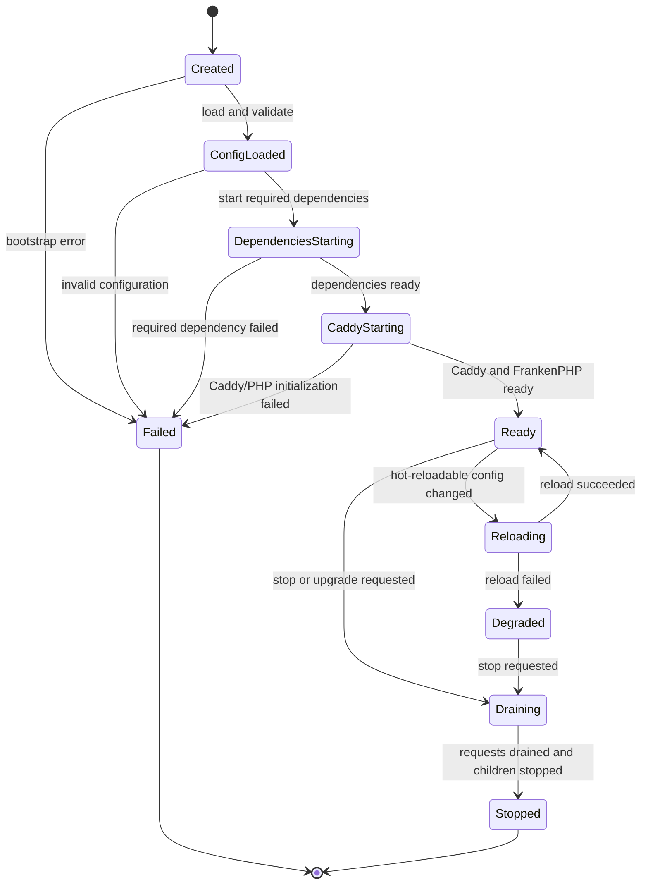

# Caddy + FrankenPHP Library Runtime Host 详细设计

## 1. 文档信息

| 项目 | 内容 |
|---|---|
| 状态 | 已实施（阶段一至四落地，三平台原生构建通过） |
| 日期 | 2026-08-18 |
| Runtime Host | 自研 Go 程序 `zentao-runtime` |
| HTTP Server | Caddy Go Library |
| PHP Runtime | FrankenPHP Go Library / Caddy Module |
| PHP 模式 | Classic mode |
| 关联文档 | [集成环境技术方案](./frankenphp-integration-technical-plan.md) |
| 构建设计 | [GitHub Actions 构建与打包详细设计](./github-actions-build-design.md) |
| 可观测性设计 | [DuckDB 与共享 Parquet 可观测性详细设计](./duckdb-parquet-observability-design.md) |

## 2. 架构决策

新的集成环境不直接分发上游 `frankenphp` CLI，而是构建禅道自己的 Go Runtime Host：

```text
zentao-runtime
  +-- Caddy Library
  |     +-- HTTP/1.1, HTTP/2, HTTP/3
  |     +-- TLS and certificate automation
  |     +-- static files, routing, middleware
  |     +-- logging and observability
  |
  +-- FrankenPHP Library
  |     +-- FrankenPHP Caddy app/module
  |     +-- PHP 8.4 ZTS Embed SAPI
  |     +-- Classic request execution
  |     +-- ionCube Loader
  |
  +-- DuckDB Library
  |     +-- metrics/logs aggregation and Parquet publishing
  |     +-- resource-limited Parquet query
  |
  +-- ZenTao Runtime Host
        +-- configuration and validation
        +-- lifecycle and graceful shutdown
        +-- Scheduler/MySQL supervision
        +-- local control plane
        +-- health and diagnostics
        +-- installation, upgrade and backup hooks
```

该方案保留 Caddy 和 FrankenPHP 的成熟 HTTP/PHP 能力，同时允许禅道在同一个 Go Host 中增加集成环境所需的功能。

## 3. 选择 Caddy Module 集成方式

FrankenPHP 可以直接通过以下 API 接入普通 Go `net/http`：

```text
frankenphp.Init
frankenphp.NewRequestWithContext
frankenphp.ServeHTTP
frankenphp.Shutdown
```

本方案不选择直接 `net/http` 作为正式 Web 引擎，而是选择：

> Caddy 作为进程内 Library，FrankenPHP 通过官方 Caddy module 接入 Caddy。

原因如下：

1. 保留 Caddy 自动 HTTPS、HTTP/2、HTTP/3 和证书生命周期能力。
2. 复用 FrankenPHP `php_server` 对静态文件、PHP 脚本、PATH_INFO、`try_files` 和 canonical path 的处理。
3. 避免 Runtime Host 自行实现 CGI 环境变量、脚本路径拆分和 CVE-2019-11043 类路径安全逻辑。
4. 可以通过 Go blank import 增加经过评审的 Caddy module。
5. Caddy 支持配置热加载和优雅连接迁移。
6. Runtime Host 仍拥有进程启动、配置生成、管理接口和其他子服务生命周期。

## 4. 初始化所有权

### 4.1 单一所有者原则

使用 FrankenPHP Caddy module 时，由 Caddy 中的 FrankenPHP app/module 负责：

- 调用 `frankenphp.Init()`。
- 初始化 PHP 主线程和 ZTS 线程池。
- 注册 Classic request handler。
- 在 Caddy app 停止时调用 `frankenphp.Shutdown()`。

Runtime Host 不得再次直接调用 `frankenphp.Init()` 或 `frankenphp.Shutdown()`，否则会触发重复初始化、错误状态或竞态。

### 4.2 Library 注册

最终 Go Host 通过显式导入注册所需 module，设计示意：

```go
import (
    "github.com/caddyserver/caddy/v2"

    _ "github.com/caddyserver/caddy/v2/modules/standard"
    _ "github.com/dunglas/frankenphp/caddy"
)
```

实际 import path 和版本必须以锁定的 FrankenPHP `go.mod` 为准。

不建议无选择地导入所有第三方 Caddy module。每增加一个 module，都需要评审许可证、依赖、配置入口和安全边界。

## 5. 运行时进程模型

### 5.1 Classic mode 的准确含义

Classic mode 不保留禅道 PHP 应用对象和请求状态。每个请求执行：

```text
php_request_startup
  -> execute target PHP script
  -> php_request_shutdown
```

但以下内容仍会在 `zentao-runtime` 进程生命周期内存在：

- Caddy Server。
- FrankenPHP PHP main thread。
- PHP ZTS regular thread pool。
- ionCube、OPcache 和其他 PHP extension 的模块级状态。

因此“非 worker mode”不等于每个请求启动一个新 OS 进程，也不等于 PHP Runtime 完全没有常驻线程。

### 5.2 进程角色

| 角色 | Windows/Linux Full | Windows/Linux Runtime | Docker |
|---|---|---|---|
| Web/Caddy/FrankenPHP | `zentao-runtime` 主进程 | `zentao-runtime` 主进程 | Web 容器主进程 |
| Scheduler | Host 管理的子进程或独立服务 | Host 管理的子进程或独立服务 | 独立 Scheduler 容器 |
| MySQL | Host 管理的子进程或独立服务 | 无 | 独立 MySQL 容器 |
| Control plane | Host 本地 IPC | Host 本地 IPC | 容器命令/本地 IPC |
| DuckDB Observability | Host 内嵌 Library | Host 内嵌 Library | Web 容器内嵌 Library |

Host 对子进程提供统一管理接口，但 Scheduler 和 MySQL 不进入 Caddy/FrankenPHP 线程池。

## 6. Runtime Host 职责

### 6.1 必须负责

- 加载和验证 Runtime 配置。
- 检查目录、权限、端口和依赖。
- 生成 Caddy JSON 配置。
- 注册 Caddy 和 FrankenPHP modules。
- 启动、重载和停止 Caddy。
- 管理可选 MySQL 和 Scheduler 生命周期。
- 提供本地管理 API。
- 输出结构化日志、健康状态和诊断信息。
- 使用 DuckDB 批量生成和查询本地或共享 NFS 上的指标/日志 Parquet 数据集。
- 生成首次安装凭据和配置。
- 协调备份、恢复和升级流程。
- 暴露构建版本与组件 manifest。

### 6.2 不负责

- 不重新实现 PHP SAPI。
- 不重新实现 Caddy 路由器或 TLS 协议栈。
- 不在 Go 中实现 MySQL 数据存储。
- 不将禅道 PHP 业务逻辑迁入 Host。
- 不启用 FrankenPHP worker mode。
- 不通过公共 HTTP 接口暴露高权限管理操作。

## 7. Host 模块设计

建议的未来 Go 包结构：

```text
runtime-host/
  cmd/zentao-runtime/
    main.go
  internal/
    app/            process bootstrap and dependency wiring
    config/         schema, load, validate and migration
    web/            Caddy config generation and lifecycle
    php/            PHP/FrankenPHP compatibility inspection
    supervisor/     Scheduler and MySQL process management
    control/        local IPC and administrative commands
    health/         liveness, readiness and dependency state
    logging/        structured logs, rotation and redaction
    observability/  metrics aggregation, spool, DuckDB and Parquet publishing/query
    install/        first-run initialization
    backup/         backup and restore orchestration
    upgrade/        staged upgrade and rollback coordination
    platform/
      linux/        systemd, Unix socket, signals and permissions
      windows/      SCM, named pipe, Job Object and ACL
    manifest/       build/component metadata
```

业务层依赖接口，平台包提供实现，避免在通用逻辑中散布 Windows/Linux 条件判断。

## 8. Host 生命周期

### 8.1 状态机



### 8.2 启动顺序

```text
1. 初始化最小日志
2. 解析 CLI 和运行角色
3. 获取单实例锁
4. 加载并迁移配置 schema
5. 校验 manifest、目录、权限和端口
6. 初始化正式结构化日志
7. 启动 Full 版 MySQL（如由 Host 管理）
8. 等待数据库 readiness
9. 启动 Scheduler（策略允许时）
10. 生成并校验 Caddy JSON
11. 加载 Caddy，间接初始化 FrankenPHP/PHP
12. 执行内部 readiness probe
13. 标记 Runtime Ready
```

外部流量只在 Caddy 和 PHP 冒烟检查成功后接收。

### 8.3 停止顺序

```text
1. 标记 not ready
2. 停止接收新的管理操作
3. 触发 Caddy graceful shutdown/drain
4. 等待在途 PHP 请求结束，超过期限后取消
5. 停止 Scheduler
6. 请求 MySQL 正常关闭
7. 刷新日志和状态
8. 释放单实例锁
```

不能在收到停止信号后立即强杀 PHP 或 MySQL。

## 9. Caddy Library 集成

### 9.1 配置形式

Host 内部以结构化模型生成 Caddy JSON，并通过 Caddy Library API 加载。Caddyfile 可以作为高级用户输入，但进入 Runtime 前必须转换、验证并生成最终 JSON。

推荐优先级：

```text
内置安全默认值
  < Runtime 配置文件
  < 管理工具写入的显式设置
  < 受控高级 Caddy 扩展配置
```

用户扩展不能覆盖强制安全策略，例如内部目录保护和管理接口监听地址。

### 9.2 Caddy 配置模型

Host 至少生成：

- HTTP/HTTPS listeners。
- 自动 TLS 或用户证书配置。
- Hostname 和可信代理。
- 静态文件处理。
- FrankenPHP `php_server` route。
- PATH_INFO split path。
- 上传大小和超时。
- 压缩。
- 安全响应头。
- 访问日志和错误日志。
- 内部路径拒绝规则。

### 9.3 禅道路由

文档根目录固定指向：

```text
<app-root>/www
```

路由必须满足：

1. 存在的静态文件直接返回。
2. PHP 文件交给 FrankenPHP。
3. PATH_INFO 正确拆分并设置 `SCRIPT_FILENAME`、`SCRIPT_NAME` 和 `PATH_INFO`。
4. 找不到的路径按禅道入口规则处理。
5. 非法 NUL、目录穿越和不存在的脚本返回 4xx。
6. 不允许访问应用根目录中 `www` 之外的文件。

优先复用 FrankenPHP Caddy module 的 `php_server` route generation，不在 Host 中复制其内部算法。

### 9.4 Caddy Admin API

默认不向 TCP 网络公开 Caddy Admin API。

配置更新由 Host 通过进程内 Caddy Library API完成。若某些能力必须使用 Admin API：

- Linux 仅绑定 Unix domain socket 或 loopback 随机端口。
- Windows 仅绑定 loopback，并由 Host 本地 control plane 代理。
- 不允许直接从公共 Web 入口访问。

## 10. FrankenPHP 配置

### 10.1 Classic only

Host 生成的 FrankenPHP app 配置禁止 worker 定义。配置校验发现 worker script、worker 数量或 worker route 时直接拒绝启动。

### 10.2 线程参数

可配置：

```text
num_threads
max_threads
max_wait_time
max_idle_time
max_requests
PHP ini overrides
```

默认值应基于 CPU 和内存预算，而不是只按 CPU 数量无限扩张。每个 PHP thread 的实际内存需要通过禅道全版本压测测量。

### 10.3 PHP 启动验证

Host 在 readiness 阶段验证：

- PHP 版本为锁定的 8.4 patch 版本。
- ZTS enabled。
- Zend Signals disabled。
- Zend Max Execution Timers enabled。
- ionCube Loader loaded。
- 必需 PHP extensions loaded。
- 应用 `tmp` 和附件目录可写；文件 Session 模式下实际 `session.save_path` 可写，多节点时共享挂载检查通过。
- Redis Session 模式下 PHP Redis 扩展已加载，连接参数可解析；共享后端读写由受限 PHP Deep health 探针验证。

验证失败时 Caddy 不进入 Ready。

## 11. 配置热更新边界

### 11.1 可以热更新

- 监听域名和证书策略。
- Caddy route 和 header。
- 静态文件缓存策略。
- 访问日志级别和输出位置。
- 可信代理列表。
- HTTP 超时和请求体限制。

通过生成新 Caddy JSON、完整验证和原子 `Load` 完成。失败时继续使用旧配置。

### 11.2 必须重启 Host

- PHP 主版本、patch 版本或 ABI。
- `php.ini` 中 module startup 级设置。
- ionCube、OPcache 或其他 Zend extension。
- PHP extension DLL/SO 列表。
- FrankenPHP PHP thread 初始化参数中无法安全 reload 的部分。
- Runtime 动态库。
- Host 自身二进制。

### 11.3 配置事务

```text
读取候选配置
  -> schema validation
  -> semantic validation
  -> render Caddy JSON
  -> Caddy config validation
  -> classify hot reload or restart
  -> apply
  -> health verification
  -> commit active configuration
```

配置失败不得覆盖最后一份可用配置。

## 12. 本地 Control Plane

### 12.1 通信方式

| 平台 | 默认方式 |
|---|---|
| Linux | Unix domain socket `/run/zentao/runtime.sock` |
| Windows | Named pipe `\\.\pipe\zentao-runtime` |
| Docker | 容器内 Unix socket 或命令接口 |

Control plane 不监听公共网卡。

### 12.2 管理操作

```text
status
version
health
reload
restart-required
start/stop scheduler
start/stop mysql
backup
restore
diagnose
prepare-upgrade
apply-upgrade
collect-logs
```

### 12.3 权限

- Linux socket owner/group 和 mode 限制管理员访问。
- Windows named pipe 使用明确 ACL。
- 每个危险操作进行服务端权限检查。
- 日志记录操作者、操作、时间、结果，但不记录密码和 Token。

## 13. 子进程管理

### 13.1 抽象

```text
ManagedProcess
  Start(ctx)
  Stop(ctx)
  Restart(ctx)
  Status()
  Health(ctx)
  Logs()
```

Scheduler 和 MySQL 分别实现，不允许用字符串拼接 shell command。

### 13.2 Linux

服务安装模式优先由 systemd 管理 Runtime Host。Host 管理的子进程应：

- 设置独立 process group。
- 传递最小环境变量。
- 正确回收退出状态。
- 在 Host 退出时按顺序终止。
- 不依赖 shell 展开。

MySQL 是否由 Host 直接创建子进程，还是作为单独 systemd unit，由部署模式决定。Host 提供统一控制接口。

### 13.3 Windows

`zentao-runtime.exe` 注册为 Windows Service。Host 管理子进程时使用 Windows Job Object，确保：

- Host 异常退出后不会遗留孤儿进程。
- 子进程权限和环境受控。
- 停止服务时先优雅停止 MySQL，再关闭 Job Object。

### 13.4 Docker

Web 容器不在内部拉起 MySQL。Scheduler 也建议独立容器，以便独立健康检查和重启。

## 14. CLI 设计

同一个二进制提供服务入口和管理客户端：

```text
zentao-runtime run
zentao-runtime install
zentao-runtime uninstall
zentao-runtime status
zentao-runtime reload
zentao-runtime backup
zentao-runtime restore
zentao-runtime diagnose
zentao-runtime logs --since <duration>
zentao-runtime metrics --since <duration> --name <metric>
zentao-runtime version
zentao-runtime php-cli -- <args>
```

除 `run`、首次 `install` 和离线诊断外，管理命令应连接本地 control plane，不直接修改正在运行实例的文件。

`php-cli` 必须使用与 Web 相同的 PHP Runtime、主配置和 ionCube Loader。

## 15. 健康检查

### 15.1 Liveness

表示 Host event loop 未死锁，不代表禅道可用。

### 15.2 Readiness

至少满足：

- Caddy 已加载有效配置。
- FrankenPHP/PHP 已初始化。
- ionCube 和必需扩展已加载。
- 应用根目录有效。
- Full 版本地 MySQL 已 ready，或外部数据库连接策略允许启动。
- 关键可写目录有效。
- 启用可观测性时，DuckDB 已初始化，本地 spool 可写；共享 Parquet NFS 异常只标记 degraded，不阻止 Web Ready。

### 15.3 Deep health

按需执行：

- 内部 PHP 请求。
- 数据库查询。
- 按实际 PHP Handler 执行 Session 临时写入、读取和删除；文件模式同时检查共享挂载，Redis 模式不由 Go 直接连接。
- Scheduler heartbeat。
- 磁盘空间和备份目录检查。
- DuckDB 最小内存查询、Parquet 临时文件发布能力、本地 spool 配额和共享数据集挂载身份。

Deep health 不能由高频公共探针触发，避免对数据库和磁盘造成压力。

## 16. 日志与指标

### 16.1 日志来源

```text
host
caddy.access
caddy.error
php
zentao
scheduler
mysql
upgrade
audit
```

Host 使用 Go `slog` 或兼容接口输出结构化日志。Caddy 和 FrankenPHP logger 接入同一日志管线，但保持 source 字段区分。日志经过脱敏和有界缓冲后，由 DuckDB 批量生成 Parquet；Audit、安装、升级和安全日志仍保留追加式轮转文件，Parquet 不是唯一合规副本。

### 16.2 脱敏

禁止记录：

- 数据库密码。
- Cookie、Session ID 和 Authorization。
- ionCube 授权内容。
- GitHub/Registry Token。
- 完整用户上传内容。

### 16.3 指标

可选指标：

- HTTP request count/duration/status。
- Active Caddy connections。
- FrankenPHP thread total/busy/wait。
- PHP request duration/error。
- Scheduler last success。
- MySQL child process state。
- Runtime reload/restart count。

指标端点默认只绑定本地或管理网络。

指标在写入 Parquet 前按时间窗口聚合。多节点不共享 `.duckdb` 文件，而是在 NFS 上共享 Hive 分区 Parquet 数据集；每个节点只发布自己的不可变 part 文件。查询使用服务端固定数据根目录和字段 allowlist，不接受公共任意 SQL。

详细设计参见 [DuckDB 与共享 Parquet 可观测性详细设计](./duckdb-parquet-observability-design.md)。

## 17. 安全边界

1. Caddy public listener 只处理用户 Web 流量。
2. Host control plane 只使用本地 IPC。
3. Caddy Admin API 默认不公开。
4. Runtime Host 使用低权限服务账号。
5. MySQL 使用独立账号和目录权限。
6. 高权限安装/升级通过短生命周期提升权限操作完成。
7. Host 不接受任意 shell command。
8. 高级 Caddy module 使用 allowlist。
9. 配置、插件和 Runtime 更新都进行签名校验。
10. 公共请求中带下划线的非白名单 Header 应移除，避免 CGI Header 混淆。
11. DuckDB 禁止网络安装/自动加载未审核 Extension，禁止读取配置根目录之外的任意文件或 URL。

## 18. Runtime 更新

Runtime Host 自更新采用外部 helper 或双进程切换，不能直接覆盖正在执行的 Windows EXE 或 Linux binary。

```text
下载 signed update
  -> verify signature and manifest
  -> unpack to new release directory
  -> preflight new binary
  -> enter maintenance mode
  -> stop scheduler
  -> drain Caddy/PHP
  -> switch runtime pointer/service ImagePath
  -> start new Host
  -> health verification
  -> commit or rollback
```

数据库升级前必须完成可恢复备份。应用回滚和数据库回滚需要分别处理。

## 19. Go 构建方式

最终构建对象从上游 `frankenphp` CLI 改为：

```text
./cmd/zentao-runtime
```

`go.mod` 固定：

- Caddy exact module version。
- FrankenPHP exact module version/commit。
- 自研依赖 exact version。

Linux 构建：

```text
CGO_ENABLED=1
CGO_CFLAGS=<patched PHP php-config --includes>
CGO_LDFLAGS=<patched PHP php-config --ldflags/--libs>
go build ./cmd/zentao-runtime
```

Windows 构建：

```text
CC=clang
CXX=clang++
CGO_ENABLED=1
CGO_CFLAGS=<PHP VS17 development includes>
CGO_LDFLAGS=-lphp8ts -lphp8embed plus required libraries
go build ./cmd/zentao-runtime
```

不再需要使用 `xcaddy` 生成主程序。Caddy 和 FrankenPHP modules 由自研 main package 显式导入。若仍使用 xcaddy，只能作为生成依赖清单的辅助工具，不能覆盖自研 Host main。

## 20. 构建元数据

通过 Go ldflags 写入：

```text
HostVersion
GitCommit
BuildTime
PHPVersion
FrankenPHPVersion
CaddyVersion
DuckDBVersion
RuntimeRevision
```

运行时 `version` 命令同时读取编译元数据和外部 `manifest.json`，两者不一致时报告 Runtime 完整性错误。

## 21. 测试策略

### 21.1 Host 单元测试

- 配置解析和迁移。
- Caddy JSON 生成。
- 热更新分类。
- 生命周期状态机。
- 子进程退出和重启策略。
- Control plane 鉴权。
- 日志脱敏。
- 度量聚合、Batch ID、Parquet 路径、spool 恢复和节点目录所有权。

### 21.2 Library 集成测试

- Caddy Library 加载与停止。
- FrankenPHP module 只初始化一次。
- Classic PHP 请求。
- PATH_INFO 和静态文件。
- Caddy graceful reload 不破坏 PHP 请求。
- Host shutdown 触发 FrankenPHP 正常关闭。
- DuckDB 与 PHP Embed/FrankenPHP 同进程加载，Parquet 批次可以在优雅停止时有界 flush。

### 21.3 平台测试

- Linux systemd 和 Unix socket。
- Windows Service、Named Pipe 和 Job Object。
- Docker PID 1、signals 和只读文件系统。
- 三平台 DuckDB/Parquet 读写和 Windows 非 ASCII 路径。

### 21.4 失败注入

- Caddy 端口占用。
- PHP/ionCube 初始化失败。
- MySQL 启动超时。
- Scheduler 崩溃。
- 配置 reload 失败。
- 磁盘空间不足。
- NFS 中断、Parquet 发布崩溃、本地 spool 满和 DuckDB 查询超限。
- 升级后 health check 失败。

## 22. 关键约束

1. 一个 Host 进程只能有一个 FrankenPHP Runtime 实例。
2. 同一进程不能并行加载两套 PHP ABI 或两份 `php.ini` module 配置。
3. Caddy module 负责 FrankenPHP 生命周期时，Host 不直接调用 FrankenPHP Init/Shutdown。
4. Caddy 热加载不等价于 PHP Runtime 热替换。
5. Classic mode 仍使用常驻 ZTS thread pool，但不复用禅道请求状态。
6. Web、CLI 和 Scheduler 必须使用同一 PHP 版本与 ionCube Loader。
7. Linux ionCube ABI shim 仍是 PHP 构建的一部分，与 Host Library 架构无冲突。
8. 不共享 `.duckdb` 文件，不允许两个节点修改同一个 Parquet 文件。
9. 可观测性故障只能降级指标/日志能力，不能阻止 Web、Scheduler 和队列继续运行。

## 23. 实施阶段

### 阶段一：最小 Host PoC

- 自研 main 链接 Caddy 和 FrankenPHP modules。
- 加载最小 Caddy JSON。
- 执行 Classic PHP 请求。
- 验证只初始化一次和优雅退出。

### 阶段二：配置与管理

- 配置 schema 和渲染。
- 本地 control plane。
- status/reload/diagnose。
- 日志和健康检查。

### 阶段三：平台服务

- Linux systemd/Unix socket。
- Windows Service/Named Pipe/Job Object。
- Scheduler/MySQL supervision。

### 阶段四：升级与扩展

- 备份、恢复和升级事务。
- 受控 Caddy module 扩展。
- 指标、诊断包和安全加固。
- DuckDB 指标/日志 Parquet、共享数据集、spool 和资源受限查询。

## 24. 验收标准

1. `zentao-runtime` 同时链接 Caddy 和 FrankenPHP Library。
2. 不依赖上游 `frankenphp` CLI 作为主进程。
3. Caddy 提供 HTTP/HTTPS、静态资源和 PHP route。
4. FrankenPHP 使用 Classic mode，付费版 ionCube 代码正常运行。
5. Caddy reload 失败时旧配置继续服务。
6. PHP Runtime 级变更被正确标记为需要进程重启。
7. Windows/Linux/Docker 都能优雅处理停止信号。
8. 管理接口不暴露到公共网络。
9. Full 版可以统一管理 Web、Scheduler 和 MySQL 状态。
10. GitHub-hosted Runner 能在三个目标平台构建并测试 Host。
11. 双节点无需选主或全局锁即可向共享 Parquet 数据集发布，并能查询所有已发布节点分区。

## 25. 待讨论事项

1. Caddy 自动 HTTPS 是否默认启用，首次本地安装如何处理证书提示。
2. 是否允许用户加载额外 Caddy module，还是只由官方 Runtime 编译时提供。
3. Windows/Linux Full 模式下 MySQL 由 Host 子进程管理，还是注册为独立系统服务。
4. Scheduler 由 Host supervision，还是始终作为独立服务。
5. Control plane 是否需要提供本地 Web UI，或首期只提供 CLI。
6. 是否对外提供 Prometheus metrics，以及默认监听策略。
7. Caddy JSON 高级配置的开放范围和兼容承诺。

## 26. 实施状态（2026-08-19）

第 23 节实施阶段一至四已全部落地：

- 自研 `cmd/zentao-runtime` 链接 Caddy 与 FrankenPHP Library，Classic
  mode、PATH_INFO、上传与异常响应验证通过。
- 配置 Schema、Control Plane（Unix Socket/Named Pipe、鉴权与审计）、
  分层健康、结构化日志、升级事务与诊断 CLI 已实现。
- Queue Engine、Scheduler、DuckDB/Parquet 可观测性与保留清理已接入 Host。
- Linux systemd、Windows Service/Named Pipe/Job Object、Docker Compose
  与 MySQL Supervisor 已实现；三平台原生构建矩阵通过。

尚未实现的设计项：`backup/restore` 管理命令与 Caddy 高级 JSON 扩展的开放
范围仍按待讨论事项处理，不属于当前 release 验收门槛。
